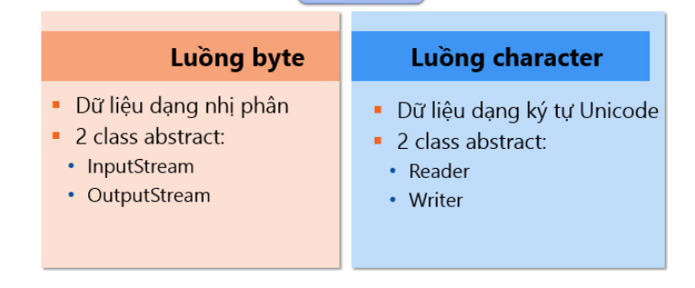
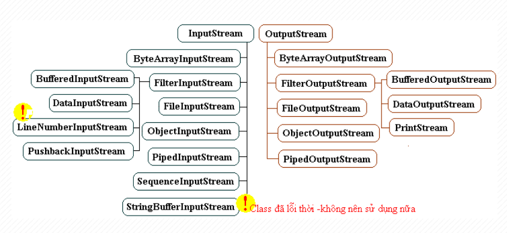
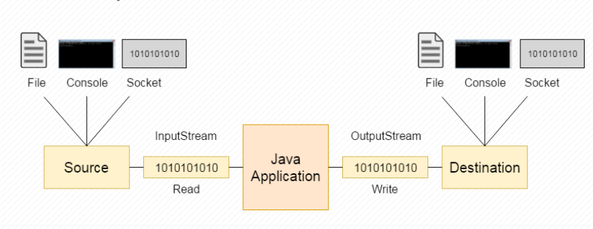
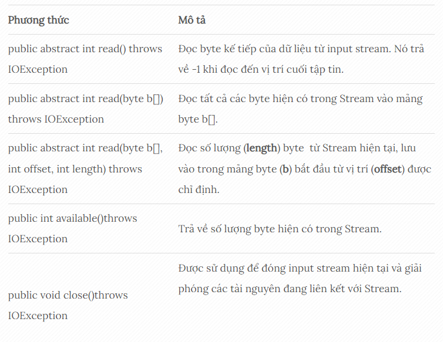
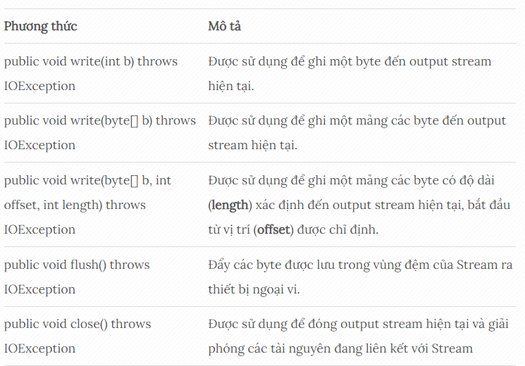
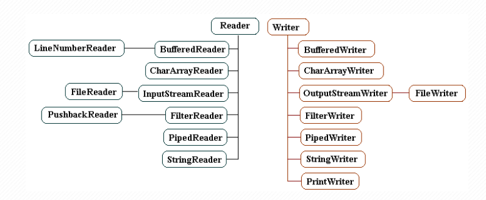
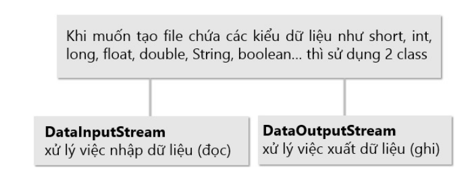
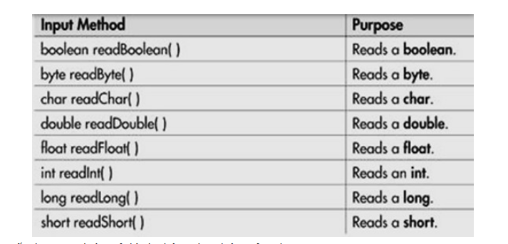
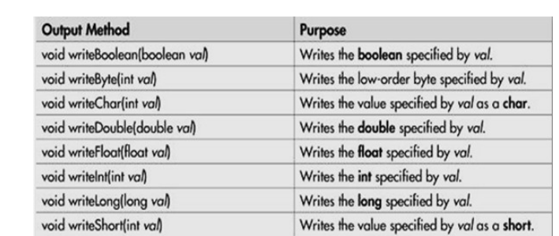

- [BUỔI 10: NHẬP XUẤT FILE, UNIT TEST](#buổi-10-nhập-xuất-file-unit-test)
  - [I. Xử lý file trong Java](#i-xử-lý-file-trong-java)
      - [1. Luồng Byte (Byte Stream)](#1-luồng-byte-byte-stream)
        - [a. Lớp InputStream](#a-lớp-inputstream)
        - [b. Lớp OutputStream](#b-lớp-outputstream)
      - [2. Luồng ký tự (Character Stream)](#2-luồng-ký-tự-character-stream)
      - [3. Đọc, ghi file](#3-đọc-ghi-file)
        - [a. Xử lý nhập xuất dữ liệu sử dụng luồng byte.](#a-xử-lý-nhập-xuất-dữ-liệu-sử-dụng-luồng-byte)
        - [b. Xử lý nhập xuất dữ liệu bằng luồng character](#b-xử-lý-nhập-xuất-dữ-liệu-bằng-luồng-character)
  - [II. Assertions](#ii-assertions)
      - [1. Assertion là gì?](#1-assertion-là-gì)
      - [2. Tại sao cần sử dụng Assertion](#2-tại-sao-cần-sử-dụng-assertion)
      - [3. Kích hoạt Assertion](#3-kích-hoạt-assertion)
      - [4. Ưu điểm của Assertion](#4-ưu-điểm-của-assertion)
      - [5. Tại sao lại cần sử dụng Assertion trong Java](#5-tại-sao-lại-cần-sử-dụng-assertion-trong-java)
  - [III. Unit Test](#iii-unit-test)
      - [1. Unit Test là gì?](#1-unit-test-là-gì)
      - [2. JUnit](#2-junit)
          - [Các tính năng của JUnit:](#các-tính-năng-của-junit)
      - [3. Một số khái niệm cần biết trong Unit Test](#3-một-số-khái-niệm-cần-biết-trong-unit-test)
      - [4. Tầm quan trọng của việc viết Unit test](#4-tầm-quan-trọng-của-việc-viết-unit-test)

# BUỔI 10: NHẬP XUẤT FILE, UNIT TEST

## I. Xử lý file trong Java
-  Trong Java, **stream** có thể được định nghĩa như một dãy liên tục dữ liệu. Java định nghĩa 2 kiểu luồng: `byte` và `ký tự` 
- Xử lý file có nghĩa là đọc và ghi dữ liệu vào một file.



#### 1. Luồng Byte (Byte Stream)
- Các luồng byte Java được sử dụng để thực hiện input và output của **byte 8-bit**. Có nhiều lớp liên quan đến các luồng byte nhưng các lớp này được dẫn đầu bởi 2 class **InputStream** và **OutputStream**:
  - `InputStream`: được sử dụng để đọc dữ liệu từ một nguồn (source).
  - `OutputStream`: được sử dụng để ghi dữ liệu đến đích (destination).



- Hoạt động của của Java OutputStream và InputStream:



##### a. Lớp InputStream
- Lớp InputStream là một lớp trừu tượng. Nó là superclass của tất cả các lớp đại diện cho một input stream của các byte.
- Phương thức trong lớp InputStream:



##### b. Lớp OutputStream
- Lớp OutputStream là một lớp trừu tượng. Nó là super class của tất cả các lớp đại diện cho một output stream của các byte. Một output stream chấp nhận ouput các byte và gửi chúng đến một nơi có thể chứa.

- Các phương thức của lớp OutputStream:



#### 2. Luồng ký tự (Character Stream)
- Luồng ký tự được sử dụng để thực hiện input và output cho **unicode 16 bit**. Có nhiều lớp liên quan đến các luồng ký tự nhưng các lớp này được dẫn đầu bởi 2 class **Reader** và **Writer**:
  - `Reader`: được sử dụng để đọc dữ liệu từ một nguồn (source).
  - `Writer`: được sử dụng để ghi dữ liệu đến đích (destination).



#### 3. Đọc, ghi file
> Link: [Tham khảo](https://giasutinhoc.vn/lap-trinh/lap-trinh-java-co-ban/doc-va-ghi-file-trong-java-bai-5-2/)
>
- **Bước 1**: Tạo đối tượng luồng và liên kết với nguồn dữ liệu.
- **Bước 2**: Thao tác dữ liệu (đọc hoặc ghi hoặc cả hai).
- **Bước 3**: Đóng luồng.
##### a. Xử lý nhập xuất dữ liệu sử dụng luồng byte.
- Sử dụng luồng byte trong các trường hợp như nhập xuất kiểu dữ liệu **nguyên thủy** (như kiểu int, float, double, boolean), nhập xuất kiểu dữ liệu kiểu **đối tượng** (object).
- Đọc và ghi dữ liệu nhị phân (binary data)



- Một số phương thức xử lý dữ liệu nhị phân của class DataInputStream:



- Một số phương thức xử lý dữ liệu nhị phân của class DataOutputStream: 




VD: Ghi dữ liệu vào `d:/mydata.bin` với DataOutputStream
```java
package HandlingFile;
import java.io.DataOutputStream;
import java.io.FileNotFoundException;
import java.io.FileOutputStream;
import java.io.IOException;

public class DataInputExample {
    public static void main(String[] args) {
        try {
            //Bước 1: Tạo đối tượng luồng và liên kết nguồn dữ liệu
            FileOutputStream fos = new FileOutputStream("d:/file/mydata.bin");
            DataOutputStream dos = new DataOutputStream(fos);
            //Bước 2: Ghi dữ liệu
            dos.writeInt(100);
            dos.writeDouble(9.5);
            //Bước 3: Đóng luồng
            fos.close();
            dos.close();
            System.out.println("Done!");
        } catch (IOException ex) {
            ex.printStackTrace();
        }
    }
}
```

##### b. Xử lý nhập xuất dữ liệu bằng luồng character
- Nếu muốn lưu trữ file chứa văn bản **Unicode** thì luồng character là lựa chọn tốt nhất, vì ưu điểm của luồng character là nó thao tác trực tiếp trên ký tự Unicode.

- Tất cả các luồng character đều được kế thừa từ 2 lớp **Reader** và **Writer**.
- VD: Ghi dữ liệu với **FileWriter**
```java
package HandlingFile;
import java.io.File;
import java.io.FileWriter;
import java.io.IOException;

public class TestCharacterStream {
  public static void main(String[] args) {
    try {
      //Bước 1: Tạo đối tượng luồng và liên kết nguồn dữ liệu
      File f = new File("D:/file/mydata.txt");
      FileWriter fw = new FileWriter(f);
      //Bước 2: Ghi dữ liệu
      fw.write("Ghi dữ liệu bằng luồng character");
      //Bước 3: Đóng luồng
      fw.close();
      } catch (IOException e) {
        System.out.println("Lỗi ghi file: " + e);
      }
  }
}
```

-> Ghi vào file "mydata.txt" dòng "Ghi dữ liệu bằng luồng character"

VD: Đọc dữ liệu với **FileReader**
```java
package HandlingFile;
import java.io.*;


// Đọc dữ liệu với FileReader
public class TestCharacterStream {
  public static void main(String[] args) {
    try {
      //Bước 1: Tạo đối tượng luồng và liên kết nguồn dữ liệu
      File f = new File("D:/file/mydata.txt");
      FileReader fr = new FileReader(f);
      //Bước 2: Đọc dữ liệu
      BufferedReader br = new BufferedReader(fr);
      String line;
      while ((line = br.readLine()) != null){
        System.out.println(line);
      }
      //Bước 3: Đóng luồng
      fr.close();
      br.close();
      } catch (Exception ex) {
        System.out.println("Lỗi đọc file: "+ex);
      }
  }
}

```

Output:
```java
Ghi dữ liệu bằng luồng character
```
## II. Assertions
#### 1. Assertion là gì?
Link: [tham khảo](https://tek4.vn/tutorial/java-tutorial/assertion)
- Câu lệnh Assertion trong Java giúp phát hiện lỗi bằng cách kiểm tra đoạn mã mà người lập trình cho là đúng.

- Một câu lệnh xác nhận được thực hiện bằng cách sử dụng từ khóa **assert**.
- Syntax:
```java
assert điều_kiện;
```
hoặc 
```java
assert boolean_expression : error_message;
```
- Ở đây, điều kiện là một biểu thức boolean mà chúng ta giả sử là đúng khi chương trình thực thi.
#### 2. Tại sao cần sử dụng Assertion
- Assertion được sử dụng bất kỳ khi nào kỹ sư phần mềm muốn kiểm tra tính đúng sai của một vấn đề trong lập trình Java.
  - Để đảm bảo rằng một mã không thể truy cập thực sự không thể truy cập được
  - Để đảm bảo rằng các giá trị giả định được viết trong các nhận xét là đúng
  - Để đảm bảo rằng trường hợp chuyển đổi mặc định không được thực thi
  - Kiểm tra trạng thái của đối tượng
  - Sử dụng tại điểm, bắt đầu của phương thức
#### 3. Kích hoạt Assertion
- Theo mặc định, các Assertion sẽ bị tắt và bị bỏ qua trong thời gian chạy.
- Để bật nó, chúng ta sử dụng câu lệnh sau trên cửa sổ dòng lệnh:
```java
java -ea:arguments
```
Hoặc 
```java
java -enableassertions:arguments
```
- Khi các Assertion được kích hoạt và điều kiện là đúng, chương trình sẽ thực thi bình thường.

- Nhưng nếu điều kiện là false, JVM sẽ đưa ra một lỗi `AssertionError` và chương trình sẽ dừng ngay lập tức.
- Ví dụ:
```java
public class Main {
    public static void main(String[] args) {
        int x = 5;
        assert x > 10 : "x is not greater than 10"; // JVM mậc định không kích hoạt Assertion nên chương trình bỏ qua dòng lệnh này
        System.out.println("x is greater than 10");
    }
}
```
Kết quả:
```java
x is greater than 10
```
- Trong đoạn mã trên, chúng ta vẫn nhận được kết quả bình thường vì chương trình này không có lỗi biên dịch và theo mặc định, các Assertion đã bị vô hiệu hóa. Tuy nhiên, sau khi bật Assertion, ta sẽ nhận được lỗi thông báo.

#### 4. Ưu điểm của Assertion
- Nhanh chóng và hiệu quả để phát hiện và sửa lỗi.
- Kiểm tra xác nhận chỉ được thực hiện trong quá trình phát triển và thử nghiệm. Chúng tự động bị xóa trong đoạn mã sinh ra trong thời gian chạy để không làm chậm quá trình thực thi chương trình.
- Làm đoạn mã trở nên dễ đọc hơn.
- Cấu hình và tối ưu hóa đoạn mã với độ tin cậy cao nhằm đảm bảo hoạt động chính xác.
#### 5. Tại sao lại cần sử dụng Assertion trong Java
- Để đảm bảo rằng một mã không thể truy cập thực sự không thể truy cập được
- Để đảm bảo rằng các giá trị giả định được viết trong các nhận xét là đúng
- Để đảm bảo rằng trường hợp chuyển đổi mặc định không được thực thi
- Kiểm tra trạng thái của đối tượng
- Sử dụng tại điểm, bắt đầu của phương thức

## III. Unit Test
#### 1. Unit Test là gì?
- Unit Test có nghĩa là kiểm thử đơn vị, một bước trong kiểm thử phần mềm. Với Unit Test, chỉ có những đơn vị hay những thành phần riêng lẻ của phần mềm được kiểm thử. Mục đích là để xác định rằng mỗi đơn vị của phần mềm đều hoạt động đúng như kỳ vọng. 
- Unit Testing được tiến hành trong quá trình phát triển (lập trình) một phần mềm. Unit Test cô biệt một phần của các mã code và đánh giá sự chính xác của chúng. Một đơn vị có thể là một hàm (function), một phương thức (method), một quy trình (procedure), một mô-đun hay một đối tượng
- Unit Test
  - Giúp **sửa bug sớm** trong chu trình phát triển sản phẩm và **tiết kiệm chi phí**
  - Giúp các lập trình viên **hiểu được nền tảng mã kiểm thử** và cho phép họ đưa ra các thay đổi nhanh chóng
  - Có thể được **sử dụng như các ghi chép** về dự án, nếu hiệu quả
  - **Tái sử dụng code**. Kết hợp cả code của bạn và kiểm thử của bạn cho dự án mới. Thay đổi code cho đến khi kiểm thử chạy được

#### 2. JUnit
- Trong Java, để thực hiện viết code cho Unit Test chúng ta có thể sử dụng một trong hai Framework: **JUnit** và **TestNG**.

- JUnit là một framework mã nguồn mở, miễn phí, đơn giản dùng để unit test cho ngôn ngữ lập trình Java. Trong Java, chúng ta thường sẽ sử dụng method để làm unit test. 
###### Các tính năng của JUnit:
- JUnit là một framework mã nguồn mở, được sử dụng để viết và chạy kiểm thử.
  - Cung cấp các annotation để định nghĩa các phương thức kiểm thử.
  - Cung cấp các Assertion để kiểm tra kết quả mong đợi.
  - Cung cấp các test runner để thực thi các test script.
  - Test case JUnit có thể được chạy tự động.
  - Test case JUnit có thể được tổ chức thành các test suite.
  - JUnit cho thấy kết quả test một cách trực quan: pass (không có lỗi) là màu xanh và fail (có lỗi) là màu đỏ.

#### 3. Một số khái niệm cần biết trong Unit Test
- **Unit Test case**: là 1 chuỗi code để đảm bảo rằng đoạn code được kiểm thử làm việc như mong đợi. Mỗi function sẽ có nhiều test case, ứng với mỗi trường hợp function chạy.
- **Setup**: là hàm được chạy trước khi chạy các test case, thường dùng để chuẩn bị dữ liệu để chạy test.
- **Teardown**: là hàm được chạy sau khi các test case chạy xong, thường dùng để xóa dữ liệu, giải phóng bộ nhớ.
- **Assert**: Mỗi test case sẽ có một hoặc nhiều câu lệnh Assert, để kiểm tra tính đúng đắn của hàm.
- **Mock**: là một đối tượng ảo, mô phỏng các tính chất và hành vi giống hệt như đối tượng thực được truyền vào bên trong khối mã đang vận hành nhằm kiểm tra tính đúng đắn của các hoạt động bên trong. Giả sử chương trình của chúng ta được chia làm 2 module: A và B. Module A đã code xong, B thì chưa. Để test module A, ta dùng mock để làm giả module B, không cần phải đợi tới khi module B code xong mới test được.
- **Test Suite** : là một tập các test case và nó cũng có thể bao gồm nhiều test suite khác, test suite chính là tổ hợp các test.

#### 4. Tầm quan trọng của việc viết Unit test
- Tạo ra môi trường lý tưởng để kiểm tra bất kỳ đoạn code nào, có khả năng thăm dò và phát hiện lỗi chính xác, duy trì sự ổn định của toàn bộ PM và giúp tiết kiệm thời gian so với công việc gỡ rối truyền thống.
- Phát hiện các thuật toán thực thi không hiệu quả, các thủ tục chạy vượt quá giới hạn thời gian.
- Phát hiện các vấn đề về thiết kế, xử lý hệ thống, thậm chí các mô hình thiết kế.
- Phát hiện các lỗi nghiêm trọng có thể xảy ra trong những tình huống rất hẹp.
- Tạo hàng rào an toàn cho các khối mã: Bất kỳ sự thay đổi nào cũng có thể tác động đến hàng rào này và thông báo những nguy hiểm tiềm tàng.


