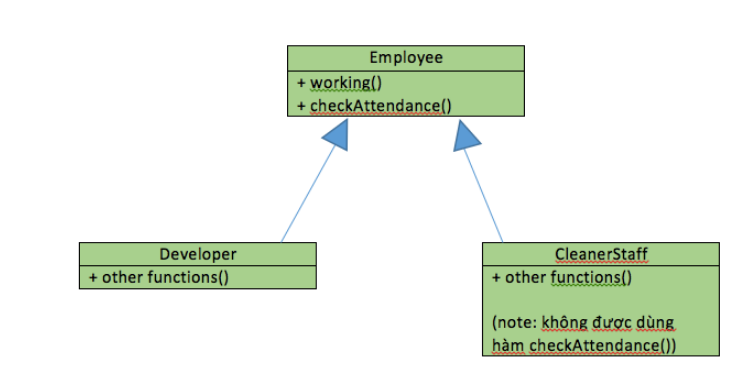
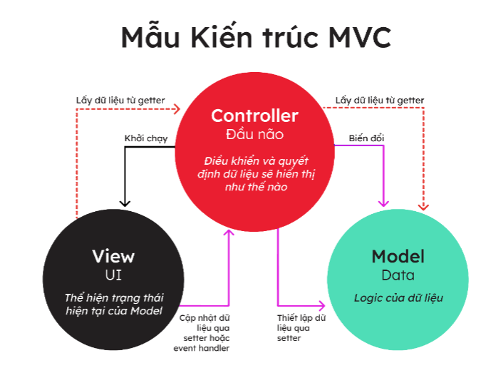
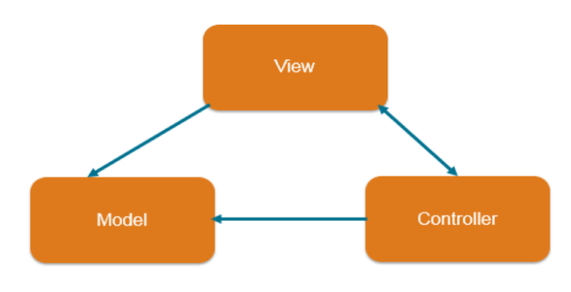
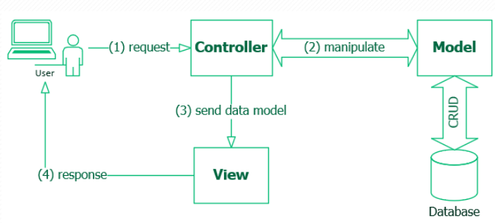

- [BUỔI 11: CÁC NGUYÊN TẮC THIẾT KẾ, MÔ HÌNH THIẾT KẾ](#buổi-11-các-nguyên-tắc-thiết-kế-mô-hình-thiết-kế)
  - [I. SOLID là gì?](#i-solid-là-gì)
    - [1. Single responsibility principle (SRP) – Nguyên lý đơn chức năng](#1-single-responsibility-principle-srp--nguyên-lý-đơn-chức-năng)
    - [2. Open-Closed principle (OCP) – Nguyên lý đóng mở](#2-open-closed-principle-ocp--nguyên-lý-đóng-mở)
    - [3. Liskov substitution principle (LSP) – Nguyên lý thay thế](#3-liskov-substitution-principle-lsp--nguyên-lý-thay-thế)
  - [II. KISS, DRY, YAGNI](#ii-kiss-dry-yagni)
    - [1. KISS - Keep It Simple, Stupid](#1-kiss---keep-it-simple-stupid)
    - [2. DRY - Don't Repeat Yourself](#2-dry---dont-repeat-yourself)
    - [3. YAGNI - You Aren’t Gonna Need It](#3-yagni---you-arent-gonna-need-it)
  - [III. Mô hình MVC](#iii-mô-hình-mvc)
    - [1. Model](#1-model)
    - [2. View](#2-view)
    - [3. Controller](#3-controller)
    - [4. Luồng xử lý trong MVC](#4-luồng-xử-lý-trong-mvc)

# BUỔI 11: CÁC NGUYÊN TẮC THIẾT KẾ, MÔ HÌNH THIẾT KẾ

## I. SOLID là gì?
- Một trong những nguyên tắc để giúp chúng ta xây dựng được các ứng dụng OOP hiệu quả hơn đó là **SOLID**, nó là một bộ 5 nguyên tắc đã được nhắc tới từ lâu bởi các nhà phát triển phần mềm và được tổng hợp, phát biểu thành nguyên tắc bởi Robert C. Martin
- Một project áp dụng những nguyên lý này sẽ có code dễ đọc, dễ test, rõ ràng hơn. Và việc quan trọng nhất là việc maintainance code sẽ dễ hơn rất nhiều
- 5 nguyên tắc đó bao gồm:
  - **S**ingle responsibility priciple (SRP)
  - **O**pen/Closed principle (OCP)
  - **L**iskov substitution principe (LSP)
  - **I**nterface segregation principle (ISP)
  - **D**ependency inversion principle (DIP)

### 1. Single responsibility principle (SRP) – Nguyên lý đơn chức năng
> Một class chỉ nên giữ 1 trách nhiệm duy nhất, chỉ nên sửa đổi class với 1 lý do duy nhất. 
> *(A class should have one and only one reason to change, meaning that a class should have only one job.)*
- Một class có quá nhiều chức năng sẽ trở nên cồng kềnh và trở nên khó đọc, khó maintain.
- Lợi ích:
  - Kiểm thử chức năng : Class chỉ có 1 nhiệm vụ nên việc test hoặc làm unit rất đơn giản chỉ cần vài testcase có thể kiểm tra được chất lượng code.
  - Giảm phụ thuộc : Ít chức năng (method) trong class dẫn đến ít sự phụ thuộc.
  - Tổ chức code của dự án : Các file code càng nhỏ thì dễ quản lý và tìm kiếm.
- VD: 
```java
public class Employee {
    String position;
    public void developSoftware(){};
    public void testSoftware(){};
    public void saleSoftware(){};
}
```
- Nếu có thêm một chức vụ nữa là quản lí nhân sự, ta sẽ phải sửa lại lớp Employee, thêm phương thức mới, hay nếu có thêm 10 chức vụ nữa txhì sao? Khi đó các đối tượng được tạo ra sẽ dư thừa rất nhiều phương thức.
- Ta phải tách class này ra làm nhiều class riêng, mỗi class chỉ làm một nhiệm vụ duy nhất. Tuy số lượng class nhiều hơn những việc sửa chữa sẽ đơn giản hơn, dễ dàng tái sử dụng hơn, class ngắn hơn nên cũng ít bug hơn
- Áp dụng nguyên tắc `Single Responsibility`: mỗi lớp 1 trách nhiệm. Ta sẽ tạo 1 lớp trừu tượng là “Employee” có phương thức là `working()`, từ đây bạn kế thừa ra 3 lớp cụ thể là `Developer`, `Tester` và `Salesman`. Ở mỗi lớp này bạn sẽ implement phương thức working() cụ thể tuy theo nhiệm vụ của từng người. 

### 2. Open-Closed principle (OCP) – Nguyên lý đóng mở
> Có thể thoải mái mở rộng 1 class, nhưng không nên sửa đổi bên trong class đó. 
> *(Objects or entities should be open for extension, but closed for modification.)*
- Theo nguyên lý này, chúng ta không được thay đổi hiện trạng của các lớp có sẵn, nếu muốn thêm tính năng mới, thì hãy mở rộng class cũ bằng cách kế thừa để xây dựng class mới. Làm như vậy sẽ tránh được các tình huống làm hỏng tính ổn định của chương trình đang có.
- VD khi viết phương thức thanh toán online tại thời điểm mình viết thì chỉ chấp nhận ví MOMO,  nhưng trong tương lai có thể chấp nhận Master hoặc Visa. Chính vì vậy khi tạo ra một class thì phải có tính năng mở rộng.
- Close Modification có nghĩa là không nên nhảy vô code đang có mà sửa đổi, đều này cực kỳ nghiêm trọng vì có những lúc code cũ đang chạy ngon. Mình vào sửa vài dòng code lúc này vô tình ảnh hưởng tới các chức năng khác gây nên tình trạng lỗi. 
- VD: Khi  muốn viết một class tính toán diện tích của các hình, ta sẽ tạo một abstract class chung, sau đó cho các class là các hình cụ thể implement nó
```java
public abstract class Shape {
    public abstract double Area();
}

```
```java
public class Circle extends Shape{
    public double radius;
    @Override
    public double Area() {
        return radius*radius*3.14;
    }
}


public class Rectangle extends Shape{
    public double width, height;
    @Override
    public double Area() {
        return width * height;
    }
}

```

### 3. Liskov substitution principle (LSP) – Nguyên lý thay thế
> Trong một chương trình, các object của class con có thể thay thế class cha mà không làm thay đổi tính đúng đắn của chương trình.

> (*Objects in a program should be replaceable with instances of their subtypes without altering the correctness of that program.)*
- Nguyên lý này được hiểu như sau nếu lớp A là subtype của lớp B. Thì khi chúng ta thay lớp B bằng lớp A thì chương trình vẫn chạy đúng chức năng và nhiệm vụ.

- Giả sử công ty thuê một nhân viên lao công, mặc dù là một người làm việc cho công ty nhưng do không được cấp số ID nên không được xem là một nhân viên bình thường, mà chỉ là một nhân viên thời vụ, do đó sẽ không được điểm danh.



- Nếu chúng ta tạo ra một lớp `CleanerStaff` kế thừa từ lớp Employee, và implement hàm `working()` cho lớp này, thì mọi thứ đều ổn, tuy nhiên lớp mới này cũng lại có hàm `checkAttendance()` để điểm danh, mà như thế là sai quy định dẫn đến chương trình bị lỗi. Như vậy, thiết kế lớp CleanerStaff kế thừa từ lớp Employee là không được phép.
- Có nhiều cách để giải quyết tình huống này ví dụ như tách hàm checkAttendance() ra một interface riêng và chỉ cho các lớp Developer, Tester và Salesman implements interface này.

## II. KISS, DRY, YAGNI
### 1. KISS - Keep It Simple, Stupid
- Nguyên tắc `KISS (Keep It Simple, Stupid)` hay còn được biết đến với 1 số biến thể `Keep It Simple and Short`, `Keep It Small and Simple` hay `Keep It Short and Straightforward`, nhưng tựu chung lại thì nó là: 
> Hãy làm mọi thứ đơn giản lại, hướng đến sự đơn giản, rõ ràng trong mọi vấn đề
- KISS có nghĩa là giữ cho code thật đơn giản, càng đơn giản, ngắn gọn càng tốt, viết code để người khác vừa đọc đã hiểu mình đang viết gì, đang thực hiện gì.
<!-- - VD:
```java
public static boolean isEven(int number){
    if (number & 1) return false;
}
```
```java
public static boolean isEven(int number){
    if (number % 2 == 1) return false;
}
```

- Ở ví dụ trên, method 2 nhanh hơn vì nó thực hiện trực tiếp với bit, nhưng method 1 dễ hiểu và thân thiện với người đọc hơn, không cần phải nhớ lại cách hoạt động của toán tử &.
- Áp dụng nguyên tắc KISS:
  - Đặt tên hàm, biến, method, class, package, comment rõ nghĩa.
  - Không lạm dụng framework, pattern.
  - Chia nhỏ task để code 1 cách rõ ràng.
  - Giới hạn mỗi method chỉ nên từ 30-50 lines, và mỗi method chỉ nên thực hiện 1 chức năng.
  - Hiểu rõ các vấn đề trước khi code.
  - Không nên sử dụng nhiều câu lệnh If trong 1 method, hãy tách nó ra thành các method khác nhau. -->
### 2. DRY - Don't Repeat Yourself
- DRY: “Don’t Repeat Yourself” – `Đừng bao giờ lặp lại code`.
- Đừng lặp lại code ở đây là không lặp lại các đoạn code giống nhau, các method thực hiện chức năng như nhau, cố gắng gom chúng lại 1 cách gọn gàng và có thể dùng lại khi cần.
- Bằng cách loại bỏ mã trùng lặp, chúng ta có thể nâng cao khả năng bảo trì mã, giảm độ phức tạp và giảm thiểu rủi ro phát sinh lỗi. 
- VD ta có 2 method:
```java
public void print(User user) {
    System.out.println("first name: "+user.getFirstName());
    System.out.println("last name: "+user.getLastName());
    System.out.println("age: "+user.getAge());
    System.out.println("email: "+user.getEmail());
    System.out.println("address: "+user.getAddress());
    System.out.println("gender: "+user.getGender());
    System.out.println("exprience: "+user.getExperience());
    // do something: print user info
}
public void preview(User user) {
    System.out.println("first name: "+user.getFirstName());
    System.out.println("last name: "+user.getLastName());
    System.out.println("age: "+user.getAge());
    System.out.println("email: "+user.getEmail());
    System.out.println("address: "+user.getAddress());
    System.out.println("gender: "+user.getGender());
    System.out.println("exprience: "+user.getExperience());
    // do something: review user
}
```
- Ta có thể tránh lặp code trường hợp này bằng cách tách phần in thông tin user ra thành 1 method và gọi tới nó:
```java
public void showUser(User user) {
    System.out.println("first name: "+user.getFirstName());
    System.out.println("last name: "+user.getLastName());
    System.out.println("age: "+user.getAge());
    System.out.println("email: "+user.getEmail());
    System.out.println("address: "+user.getAddress());
    System.out.println("gender: "+user.getGender());
    System.out.println("exprience: "+user.getExperience());
}

public void print(User user) {
    showUser(user);
    // do something: print user info
}
public void preview(User user) {
    showUser(user);
    // do something: review user
}
```
- Sau khi tách ra method `showUser()` thì ta có thể dùng lại nó hoặc nếu cần chỉnh sửa, lỗi trong việc in ra thông tin user thì ta chỉ cần sửa method showUser() là được.
### 3. YAGNI - You Aren’t Gonna Need It
- YAGNI: “You Aren’t Gonna Need It”: `Bạn không cần nó`.
- Nguyên tắc YAGN nhắc nhở các nhà phát triển chỉ triển khai chức năng khi nó thực sự cần thiết, khuyến khích cách tiếp cận tối giản để phát triển, tập trung vào việc cung cấp các tính năng quan trọng nhất một cách kịp thời.
- Bằng cách tránh triển khai các chức năng không cần thiết, chúng ta có thể tối ưu hóa thời gian phát triển, giảm độ phức tạp và tăng tính linh hoạt.
- Lợi ích:
  - **Cải thiện hiệu suất của nhà phát triển**: Bằng cách tập trung vào chức năng thiết yếu, nhà phát triển có thể cung cấp các yêu cầu hiện tại một cách hiệu quả mà không lãng phí thời gian và công sức vào các tính năng suy đoán.
  - **Cơ sở mã linh hoạt**: Việc tránh các chức năng không cần thiết cho phép cơ sở mã linh hoạt hơn. Chúng ta không phải giải quyết các giải pháp dưới mức tối ưu đã được triển khai sớm và có thể thích ứng với các yêu cầu thay đổi dễ dàng hơn.
  - **Tối ưu hóa chi phí**: tránh những công việc không cần thiết. Điều này có thể đặc biệt có giá trị khi thực hiện các dự án có nguồn lực hạn chế hoặc thời hạn chặt chẽ.
## III. Mô hình MVC
- MVC là viết tắt của cụm từ **"Model-View-Controller"**. MVC là một mẫu kiến trúc phần mềm để tạo lập giao diện người dùng trên máy tính.
 
     




- MVC chia thành 3 phần được kết nối với nhau và mỗi thành phần đều có một nhiệm vụ riêng của nó và độc lập với các thành phần khác: 
  - **Model** : là nơi lưu trữ dữ liệu người dùng, chứa business logic. Nó cho phép truy xuất dữ liệu để hiển thị hoặc thu thập dữ liệu. Model là cầu nối giữa thành phần View và Controller. Mục đích quan trọng nhất của nó là kết nối cơ sở dữ liệu (database), xử lý dữ liệu và chuẩn bị dữ liệu để chuyển đến các thành phần khác.
  - **View** : là giao diện của hệ thống, nơi dữ liệu (Model) được hiển thị, nhận tương tác trực tiếp với người dùng. Trong ứng dụng web, View là một phần của hệ thống, nơi mà các mã HTML được sinh ra và hiển thị. Một vấn đề quan trọng là View không được lấy dữ liệu trực tiếp từ Controller mà phải thông qua Model.
  - **Controller** : nhận yêu cầu, dữ liệu từ người dùng, sau đó cập nhật sang Model và cuối cùng trả kết quả lại View để show kết quả cho người dùng. Controller không chứa bất kỳ logic nghiệp vụ nào.
- Mô hình MVC trong Java giúp lập trình viên dễ dàng tách biệt giữa cách thức dữ liệu nội hàm với dữ liệu hiển thị. Sự tương tác qua lại giữa ba thành tố Model, View, Controller tạo nên hiệu quả tốt nhất cho việc lập trình.
- VD: một Controller có thể cập nhật một Model bằng cách thay đổi các thuộc tính của nhân vật trong game. Và nó có thể sửa đổi view bằng cách hiển thị nhân vật được cập nhật trong game đó.
### 1. Model
- Đây là bộ phận làm nhiệm vụ **quản lý dữ liệu**. Model có chức năng vận chuyển thông tin từ nội hàm để hiển thị đến người dùng thông qua màn hình và xử lý các thông tin để người dùng dễ dàng tiếp cận nhất.
- Là cầu nối giữa 2 thành phần bên dưới là View và Controller. Một model là dữ liệu được sử dụng bởi chương trình. Đây có thể là cơ sở dữ liệu, hoặc file XML bình thường hay một đối tượng đơn giản. Chẳng hạn như biểu tượng hay là một nhân vật trong game.
- Model hoàn toàn độc lập với các thành phần còn lại trong MVC và nó chứa các tác vụ cần thiết nhất cho quá trình lập trình .
### 2. View
- Đối với người dùng thì View có vai trò thiết yếu, đây là phần giao diện (theme) dành cho người sử dụng. 
- Nó thực hiện nhiệm vụ tạo tương tác với người dùng và hiển thị các kết quả từ tầng Controller. Đồng thời, View cũng thực hiện việc tiếp nhận các hoạt động, yêu cầu của người dùng để chuyển đến Controller xử lý.
- Nói một cách dễ hiểu. Các thành phần trong MVC giống như một website. View chính là các trang giao diện hiển thị những gì mà người dùng nhìn thấy
### 3. Controller
- Controller nhận yêu cầu, dữ liệu từ người dùng, sau đó cập nhật sang Model và cuối cùng trả kết quả lại View để show kết quả cho người dùng. Controller không chứa bất kỳ logic nghiệp vụ nào.
### 4. Luồng xử lý trong MVC
- Khi một yêu cầu của từ máy khách (Client) gửi đến Server thì bị `Controller` trong MVC chặn lại để xem đó là URL request hay sự kiện.
- Sau đó, `Controller` xử lý `input` của user rồi giao tiếp với `Model` trong MVC.
- Model chuẩn bị data và gửi lại cho Controller.
- Cuối cùng, khi xử lý xong yêu cầu thì Controller gửi dữ liệu trở lại `View` và hiển thị cho người dùng trên trình duyệt.



- Ở đây, **View không giao tiếp trực tiếp với Model**. Sự tương tác giữa View và Model sẽ chỉ được xử lý bởi Controller.
