- [BUỔI 12: THƯ VIỆN ĐỒ HOẠ SWING](#buổi-12-thư-viện-đồ-hoạ-swing)
  - [I. Thư viện đồ họa Swing cơ bản](#i-thư-viện-đồ-họa-swing-cơ-bản)
    - [1. Định nghĩa: Java Swing là gì?](#1-định-nghĩa-java-swing-là-gì)
    - [2. Ứng dụng Java Swing](#2-ứng-dụng-java-swing)
      - [Sơ đồ phân cấp lớp Java Swing](#sơ-đồ-phân-cấp-lớp-java-swing)
    - [2. Một số Component trong Swing](#2-một-số-component-trong-swing)
      - [a. JFrame](#a-jframe)
      - [b. JLabel](#b-jlabel)
      - [c. JButton](#c-jbutton)
      - [d. JTextField](#d-jtextfield)
      - [e. JTable](#e-jtable)
      - [f. JList](#f-jlist)
  - [II. BorderLayout, FlowLayout, GridLayout](#ii-borderlayout-flowlayout-gridlayout)
    - [1. BorderLayout](#1-borderlayout)
    - [2. FlowLayout](#2-flowlayout)
    - [3. GridLayout](#3-gridlayout)
  - [III. Graphics2D và Image](#iii-graphics2d-và-image)
    - [1. Graphics2D](#1-graphics2d)
    - [2. Image](#2-image)

# BUỔI 12: THƯ VIỆN ĐỒ HOẠ SWING

## I. Thư viện đồ họa Swing cơ bản
### 1. Định nghĩa: Java Swing là gì?
- Swing trong Java là một bộ công cụ Giao diện đồ họa người dùng (Graphical User Interface hay `GUI`) bao gồm các GUI component. Swing cung cấp một bộ widget và package phong phú để tạo các GUI component phức tạp cho các ứng dụng Java. Swing là một phần của Java Foundation Classes (JFC), một [API](https://topdev.vn/blog/api-la-gi/) cho các chương trình Java cung cấp GUI.
- Thư viện Java Swing được xây dựng trên đầu Java Abstract Widget Toolkit (`AWT`), một bộ công cụ GUI cũ hơn và phụ thuộc và nền tảng (platform dependent), tuy nhiên GUI thuộc loại nền tảng độc lập, bao gồm các thành phần nhẹ và phức tạp hơn AWT. 
- Sự khác biệt giữa Swing và AWT:

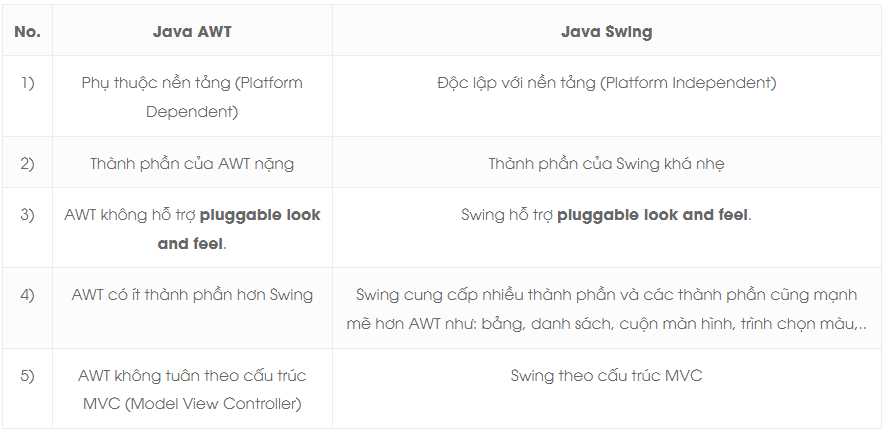

- Ta có thể sử dụng các component lập trình Java GUI như nút (button), hộp văn bản (textbox),... từ thư viện và không phải tạo các component từ đầu.
- Các gói `javax.swing` bao gồm các lớp cho Java Swing API như `JMenu`, `JButton`, `JTextField`, `JRadioButton`, `JColorChooser`,…
### 2. Ứng dụng Java Swing
- Java Swing được dùng để hỗ trợ tạo giao diện đồ hoạ người dùng (với Java).
- Bộ công cụ này cung cấp các bộ điều khiển nâng cao như thanh trượt, colorpicker, Tree, TabbedPane và bảng điều khiển,..
- Swing có những đặc điểm:
  - Độc lập với thiết bị
  - Có thể tuỳ chỉnh, mở rộng
  - Khá nhẹ
  - Có thể cấu hình

#### Sơ đồ phân cấp lớp Java Swing

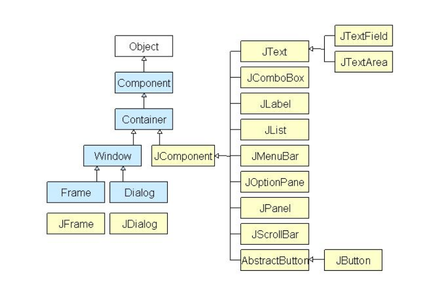

- Tất cả các thành phần trong swing được kế thừa từ lớp Jcomponent như JButton, JComboBox, JList, JLabel đều có thể được thêm vào lớp Container.
- Container là các window như Frame và Dialog. Các container này chỉ có thể thêm một thành phần vào chính nó.
- Các phương thức thường gặp ở lớp Component:

| Phương thức  | Mô tả  |
|---|---|
|public void add(Component c)   |thêm một thành phần vào thành phần khác.   |
|public void setSize(int width, int height)   |thiết lập kích thước của thành phần.   |
|public void setLayout(LayoutManager m)   |thiết lập trình quản lý bố cục (layout) cho thành phần.   |
|public void setVisible(boolean b)   |public void setVisible(boolean b)   |

### 2. Một số Component trong Swing
#### a. JFrame
- Là 1 loại Container.
- Cung cấp không gian cho các component bên trong hoạt động, được dùng để chứa và sắp xếp các phần con như Button, Label, TextField, etc.
- Giống như 1 cửa sổ window có tiêu đề và viền.

```java
package HelloSwing;
import javax.swing.JFrame;
public class HelloSwing {
    public HelloSwing(){
        JFrame frame = new JFrame("Hello Swing");
        frame.setSize(400, 400);
        frame.setVisible(true);
        frame.setDefaultCloseOperation(JFrame.EXIT_ON_CLOSE);
    }
    public static void main(String[] args) {
        new HelloSwing();
    }
}
```
- Khi chạy chương trình, 1 cửa sổ "Hello Swing" sẽ hiện ra.

    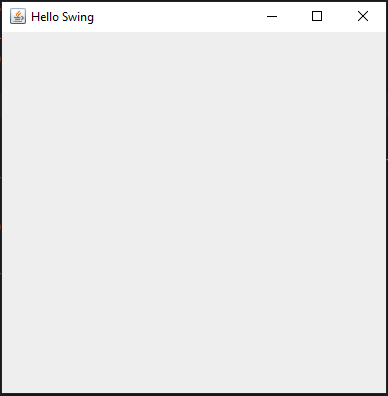
#### b. JLabel
- JLabel là một component dùng để chứa chuỗi/ văn bản/ nhãn. JLabel được dùng để hiển thị một dòng đơn và chỉ cho phép người dùng đọc. 
- JLabel thừa kế từ lớp JComponent.
- Các Constructors hay sử dụng của JLabel:

  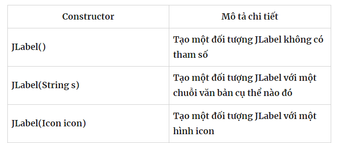

- Các phương thức cơ bản của JLabel :
  - `setText(String text)`: Đặt giá trị text cho JLabel
  - `getText()`: Lấy giá trị text của JLabel
  - `setToolTipText(String text)`: Đặt Tooltip cho JLabel ( Khi di chuột trên Label sẻ hiển thị text tip )
  - `setForeground(Color fg)`: Đặt màu cho chữ
  - `setIcon(Icon icon)`: Đặt icon cho JLabel
  - `setSize(int width, int height)`: Đặt kích thước cho JLable
  
- VD:
```java
package HelloSwing.JLableDemo;

import javax.swing.*;
import java.awt.*;

public class MyJLabel extends JFrame {
    public MyJLabel(){
        // create JFrame
        JFrame frame = new JFrame("Hello Swing");
        frame.setSize(600, 600);
        frame.setDefaultCloseOperation(JFrame.EXIT_ON_CLOSE);
        frame.setVisible(true);

        JLabel label = new JLabel("Hello JLabel", JLabel.CENTER);
        label.setOpaque(true);
        //set tool tip
        label.setToolTipText("hê lô jây lây bồ");
        
        label.setForeground(Color.BLUE);
        label.setBackground(Color.PINK);
        frame.add(label);
    }

    public static void main(String[] args) {
        MyJLabel label = new MyJLabel();
    }
}

```

  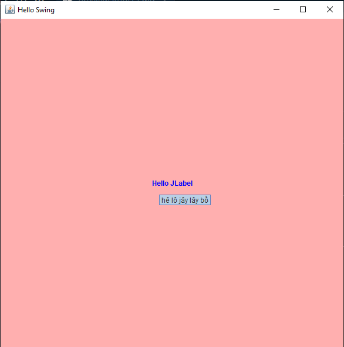

#### c. JButton
- Lớp JButton trong Java Swing được sử dụng để tạo một nút có thể *click*. Thành phần này có một label và tạo một sự kiện (event) khi được nhấn, ta cũng có thể chèn ảnh vào button.
- **Các loại Button trong Java**: Có nhiều loại button khác nhau trong Java, tất cả đều là subclass của lớp AbstractButton:
  - **Command Buttons**: được tạo với lớp JButton. Nó sinh ra ActionEvent
  – **Toggle Buttons**: có giá trị on/off hoặc true/false
  – **Check Boxes**: Một nhóm các Buttons. Nó sinh ra ItemEvent.
  – **Radio Buttons**: Một nhóm các Buttons trong đó chỉ có một item được chọn. Nó sinh ra ItemEvent
- Các constructor hay sử dụng:

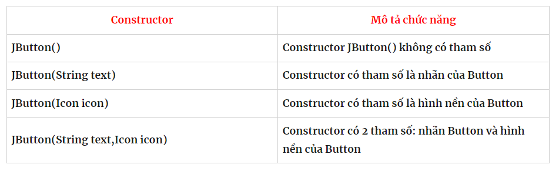

- Khởi tạo JButton:
```java
package HelloSwing.MyJButton;

import javax.swing.*;
import java.awt.*;
import java.awt.event.ActionEvent;
import java.awt.event.ActionListener;

public class MyJButton extends JFrame {
    public JLabel label;
    public MyJButton(){
        // create JFrame
        setSize(300, 200);
        setLayout(new GridLayout(2, 1, 5, 5));
        setDefaultCloseOperation(JFrame.EXIT_ON_CLOSE);

        // create JLabel
        label = new JLabel("My JLabel", JLabel.CENTER);
        add(label);

        // create JButton with text "Click Button"
        JButton button = new JButton("Click Button");
        //add action
        button.addActionListener(new ActionListener() {
            @Override
            public void actionPerformed(ActionEvent e) {
                label.setText("Clicked!");
            }
        });
        add(button);
        setVisible(true);
    }

    public static void main(String[] args) {
        new MyJButton();
    }
}

```

  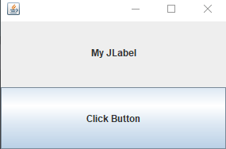         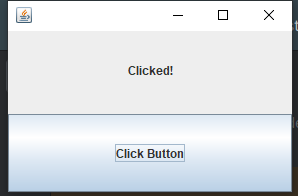


#### d. JTextField
[Tham khảo JTextField](https://websitehcm.com/java-jtextfield/)
- JTextField là component được sử dụng để nhập và hiển thị dữ liệu văn bản ngắn. Nó cung cấp một ô nhập liệu cho người dùng nhập thông tin, chẳng hạn như tên, địa chỉ, số điện thoại, v.v. JTextField cho phép người dùng gõ văn bản vào ô nhập liệu và cũng cho phép các hoạt động cơ bản như sao chép, cắt, dán và xóa.
- Các phương thức thường được sử dụng:

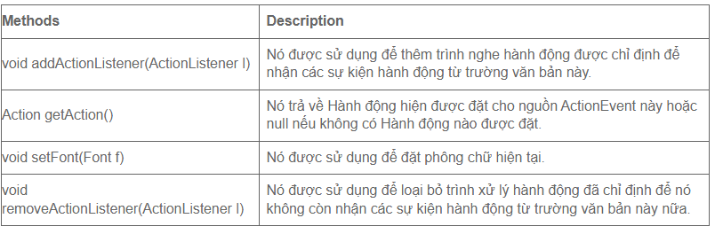

- VD:
```java
package HelloSwing.JTextField;

import javax.swing.*;

public class JTextField extends javax.swing.JTextField {
    public static void main(String[] args) {
        JFrame frame = new JFrame();
        frame.setTitle("My Frame");
        frame.setSize(500, 300);
        frame.setDefaultCloseOperation(JFrame.EXIT_ON_CLOSE);
        frame.setLocationRelativeTo(null);

        JTextField textField = new JTextField();
        frame.add(textField);

        frame.setVisible(true);
    }
}

```

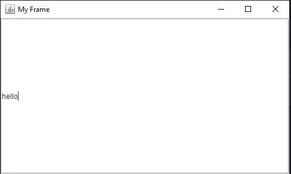

#### e. JTable
- JTable là một trong những thành phần quan trọng của Java Swing package được sử dụng để hiển thị và chỉnh sửa dữ liệu theo dạng Table (Dữ liệu được trình bày theo dạng hàng và cột). Nó tương tự như một bảng tính trong excel file.
- Khởi tạo JTable:
  - JTable cung cấp một số constructor cho phép khởi tạo một JTable instance như sau:
    - `JTable()` – Khởi tạo một JTable rỗng.
    - `JTable(int rows, int cols)` – Khởi tạo một JTable với số dòng và cột được chỉ định.
    - `JTable(Object[][] data, Object []Column)` – Khởi tạo một Jtable với các tên cột được chỉ định trong Object[] Column và dữ liệu trong Object[][] data.
  - Một số hàm thường xuyên sử dụng trong JTable:
    - `addColumn(TableColumn column)` – Thêm một cột vào cuối bảng.
    - `editCellAt(int row, int col)` – Chỉnh sửa ô giao nhau của cột số col và hàng số row, nếu các chỉ số đã cho hợp lệ và ô tương ứng có thể chỉnh sửa được.
    - `setValueAt(Object value, int row, int col)` – Cập nhật giá trị tạo ô có số cột là col và hàng row thành giá trị value mới. 
    - `clearSelection()` – Bỏ chọn tất cả các cột và hàng trước đó đã được chọn.

- VD:
```java
package HelloSwing.JTable;

import javax.swing.*;

public class JTableDemo extends javax.swing.JTable {
    public JTableDemo(){
        JFrame frame = new JFrame("My Frame");
        frame.setSize(500, 200);
        frame.setLocationRelativeTo(null);
        String[][] data = {
                {"001", "Giang", "19"},
                {"002", "Andy", "25"}
        };
        String[] columnNames = {"ID", "Name", "Age"};

        JTable table = new JTable(data, columnNames);
        table.setBounds(30, 40, 200, 300);

        JScrollPane sp = new JScrollPane(table);
        frame.add(sp);
        frame.setDefaultCloseOperation(3);
        frame.setVisible(true);
    }

    public static void main(String[] args) {
        new JTableDemo();
    }
}
```

  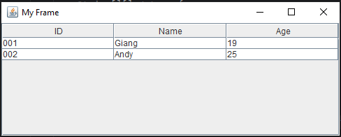

#### f. JList
- JList là một thành phần giao diện người dùng trong Java Swing cho phép hiển thị một danh sách các mục dưới dạng danh sách dọc. JList cung cấp các phương thức và tính năng cho phép tạo, hiển thị, tương tác và tùy chỉnh danh sách các mục.
- Các Constructor thường được sử dụng:

  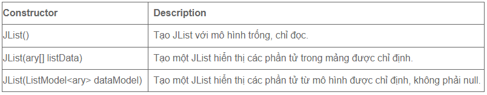

- Các phương thức thường được sử dụng:

  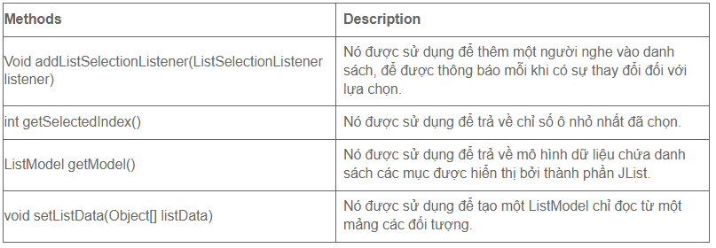
  
- VD:
```java
package HelloSwing.JList;

import javax.swing.*;
import java.awt.*;

public class JListDemo {
    public JListDemo(){
        // create JFrame
        JFrame frame = new JFrame("My JList Example");
        frame.setDefaultCloseOperation(3);
        JList list = new JList();
        String[] data = new String[]{
                "Monday",
                "Tuesday",
                "Wednesday",
                "Thursday",
                "Friday",
                "Saturday",
                "Sunday"
        };
        list.setListData(data);
        frame.add(list);
        frame.setSize(400, 400);
        frame.setVisible(true);
    }
    public static void main(String[] args) {
        new JListDemo();
    }
}
```

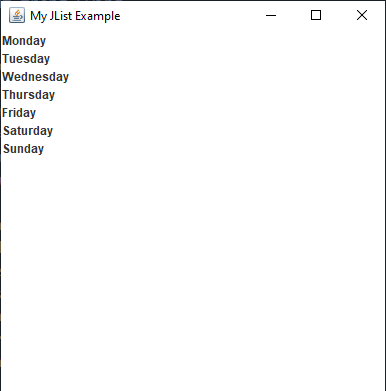

## II. BorderLayout, FlowLayout, GridLayout
### 1. BorderLayout
- BorderLayout là một trình quản lý bố trí trong Java Swing, được sử dụng để chia phần tử giao diện thành năm vùng: `north, south, west, east, center`. Mỗi vùng này có thể chứa một thành phần duy nhất và các thành phần sẽ được căn chỉnh theo vùng tương ứng.

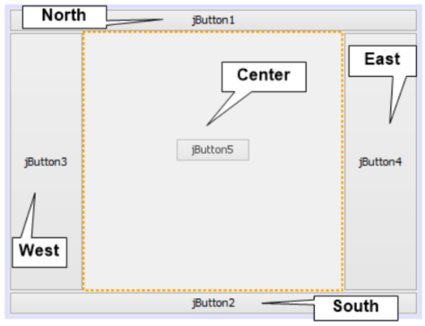

- Khác với các layout khác, kích thước của các component trong mỗi vùng là do chúng ta thiết lập chứ không phải do layout tự co dãn, ngoại trừ vùng CENTER sẽ có kích thước thay đổi tùy thuộc vào 4 vùng còn lại.

```java
package HelloSwing.Layout;

import javax.swing.*;
import java.awt.*;
import java.awt.event.ActionEvent;
import java.awt.event.ActionListener;

public class BorderLayoutDemo {
    public BorderLayoutDemo(){
        JFrame frame = new JFrame("My Example");
        JButton bt1 = new JButton("North");
        JButton bt2 = new JButton("West");
        JButton bt3 = new JButton("Center");
        JButton bt4 = new JButton("East");
        JButton bt5 = new JButton("South");

        frame.add(bt1, BorderLayout.NORTH);
        frame.add(bt2, BorderLayout.WEST);
        frame.add(bt3, BorderLayout.CENTER);
        frame.add(bt4, BorderLayout.EAST);
        frame.add(bt5, BorderLayout.SOUTH);
        
        frame.setSize(500, 500);
        frame.setDefaultCloseOperation(3);
        frame.setVisible(true);
    }
    public static void main(String[] args) {
        new BorderLayoutDemo();
    }
}
```

  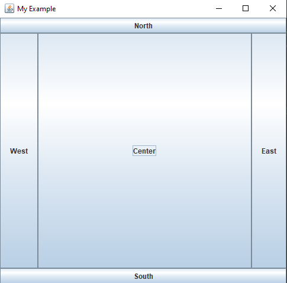

### 2. FlowLayout
- Lớp FlowLayout được sử dụng để sắp xếp các thành phần trong một line, line sau nối tiếp line trước (trong một luồng từ trái qua phải left-to-right flow). Nó là Layout mặc định của applet hoặc panel.

- Lớp FlowLayout bao gồm các trường sau:
  - **static int CENTER**: Giá trị này chỉ rằng mỗi hàng của các thành phần nên được căn chỉnh vào giữa.
  - **static int LEADING**: Giá trị này chỉ rằng mỗi hàng của các thành phần nên được căn chỉnh theo cạnh chủ đạo (leading edge) theo hướng của container, ví dụ: căn chỉnh theo cạnh trái theo hướng left-to-right.
  - **static int LEFT**: Giá trị này chỉ rằng mỗi hàng của các thành phần nên được căn chỉnh trái.
  - **static int RIGHT**: Giá trị này chỉ rằng mỗi hàng của các thành phần nên được căn chỉnh phải.
  - **static int TRAILING**: Giá trị này chỉ rằng mỗi hàng của các thành phần nên được căn chỉnh theo cạnh trailing edge theo hướng của container, ví dụ: căn chỉnh theo cạnh phải theo hướng left-to-right.

- Các constructor được sử dụng phổ biến của lớp FlowLayout:
  - **FlowLayout()**: tạo một Flow Layout với căn chỉnh trung tâm và một khoảng cách gap theo chiều dọc và ngang là 5 đơn vị.
  - **FlowLayout(int align)**: tạo một Flow Layout với căn chỉnh align đã cho và một khoảng cách gap theo chiều dọc và ngang là 5 đơn vị.
  - **FlowLayout(int align, int hgap, int vgap)**: tạo một Flow Layout với căn chỉnh align đã cho và một khoảng cách gap theo chiều dọc và ngang đã được xác định.

```java
package HelloSwing.Layout;
import java.awt.*;
import javax.swing.*;
public class FlowLayoutDemo {
    JFrame f;
    FlowLayoutDemo(){
        f = new JFrame();
        
        JButton b1 = new JButton("1");
        JButton b2 = new JButton("2");
        JButton b3 = new JButton("3");
        JButton b4 = new JButton("4");
        JButton b5 = new JButton("5");

        f.add(b1);
        f.add(b2);
        f.add(b3);
        f.add(b4);
        f.add(b5);

        f.setLayout(new FlowLayout(FlowLayout.RIGHT));
        //thiet lap flow layout la can chinh phai
        f.setSize(300,300);
        f.setDefaultCloseOperation(3);
        f.setVisible(true);
    }
    public static void main(String[] args) {
        new FlowLayoutDemo();
    }
}

```

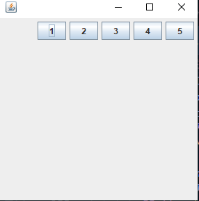

### 3. GridLayout
- Lớp GridLayout sắp xếp các thành phần trong một lưới hình chữ nhật. Một thành phần được hiển thị trong mỗi hình chữ nhật.
- Lớp GridLayout gồm các constructor sau:
  - **GridLayout()**: Tạo một grid layout với mặc định là một cột mỗi thành phần, trong một hàng đơn.
  - **GridLayout(int rows, int columns)**: Tạo một grid layout với số hàng và cột đã cho, và không có khoảng cách giữa các thành phần.
  - **GridLayout(int rows, int columns, int hgap, int vgap)**: Tạo một grid layout với các hàng và cột đã cho cùng với các khoảng cách theo chiều dọc và ngang đã xác định.
```java
package HelloSwing.Layout;

import java.awt.*;
import javax.swing.*;

public class GridLayoutDemo {
    JFrame f;
    GridLayoutDemo(){
        f=new JFrame();

        JButton b1=new JButton("1");
        JButton b2=new JButton("2");
        JButton b3=new JButton("3");
        JButton b4=new JButton("4");
        JButton b5=new JButton("5");
        JButton b6=new JButton("6");

        f.add(b1);
        f.add(b2);
        f.add(b3);
        f.add(b4);
        f.add(b5);
        f.add(b6);

        f.setLayout(new GridLayout(2,3));
        //thiet lap 2 hang va 3 cot cho grid layout
        f.setDefaultCloseOperation(3);
        f.setSize(500,500);
        f.setVisible(true);
    }
    public static void main(String[] args) {
        new GridLayoutDemo();
    }
}
```

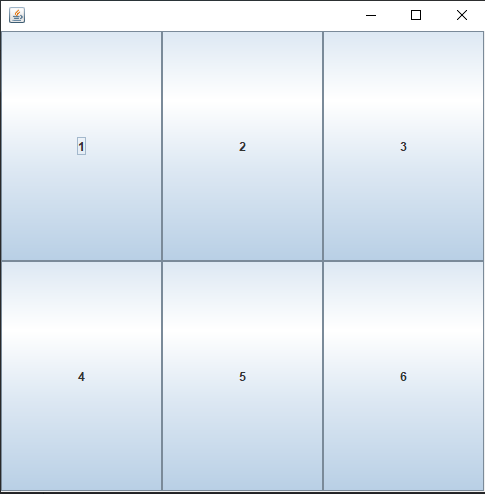

## III. Graphics2D và Image
### 1. Graphics2D
- Là lớp trừu tượng kế thừa từ lớp `Graphics`, hỗ trợ nhiều công cụ để vẽ và xuất ra hình ảnh, văn bản... trên dạng 2 chiều.
```java
package HelloSwing.Graphics;
import java.awt.Canvas;
import java.awt.Color;
import java.awt.Graphics;
import javax.swing.JFrame;

public class Graphics2DTest extends Canvas {
    public void paint(Graphics g) {
        g.drawString("Hello World", 160, 40);
        setBackground(Color.lightGray);
        g.fillRect(130, 130, 100, 80);
        g.drawOval(30, 130, 50, 60);
        setForeground(Color.DARK_GRAY);
        g.fillOval(30, 130, 50, 60);
        g.drawArc(30, 200, 40, 50, 90, 60);
        g.fillArc(30, 130, 40, 50, 180, 40);}
    public static void main(String[] args) {
        Graphics2DTest m = new Graphics2DTest();
        JFrame f = new JFrame();
        f.add(m);

        f.setSize(400, 300);
        f.setDefaultCloseOperation(3);
        f.setVisible(true);
    }
}
```

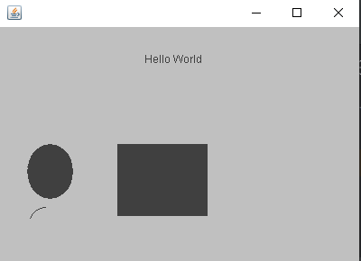

### 2. Image
- [Tham khảo](https://viettuts.vn/java-swing/lop-imageicon-trong-java-swing)
- Lớp Image là lớp trừu tượng cha cho tất cả các lớp dùng để hiển thị hình ảnh như BufferedImage, ImageIcon...
- Lớp ImageIcon là một trình triển khai của Icon Iterface, để vẽ các Icon từ các Image.
```java
package HelloSwing.Graphics;
import javax.swing.*;
import java.awt.*;

class imageTest{
    public static void main(String[] args) {
        JFrame frame = new JFrame("My Icon");
        frame.setLocationRelativeTo(null);
        frame.setSize(400, 400);
        frame.setDefaultCloseOperation(3);

        ImageIcon webIcon = new ImageIcon("C:\\Users\\Admin\\Desktop\\Giang\\cat.png");
        frame.setIconImage(webIcon.getImage());
        frame.setVisible(true);
    }
}
```

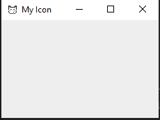


