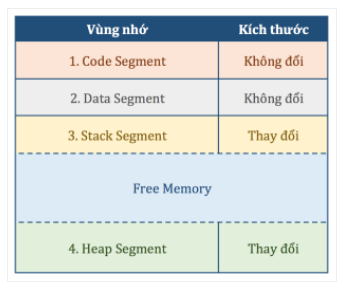
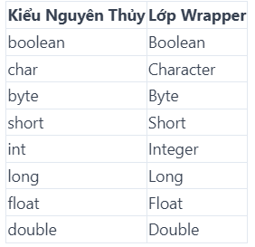
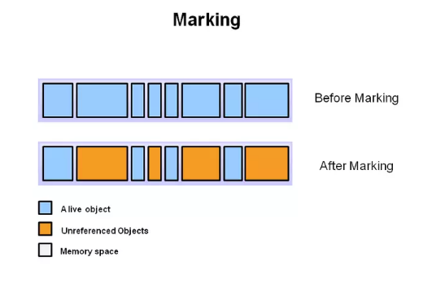
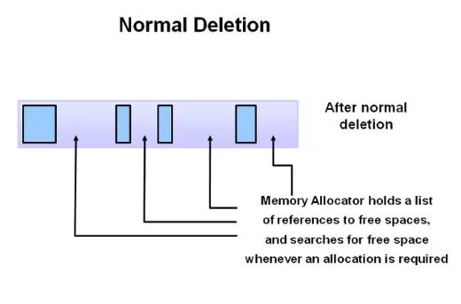
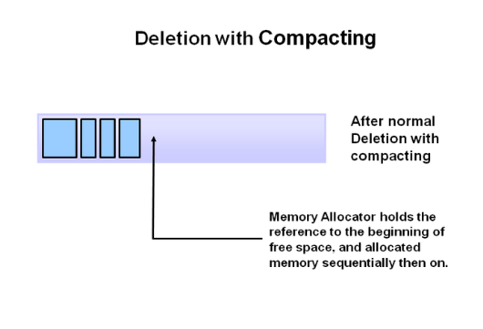

# Buổi 3: CÁCH JAVA LƯU TRỮ DỮ LIỆU
- [Buổi 3: CÁCH JAVA LƯU TRỮ DỮ LIỆU](#buổi-3-cách-java-lưu-trữ-dữ-liệu)
  - [1. Cách Java lưu trữ dữ liệu](#1-cách-java-lưu-trữ-dữ-liệu)
      - [1.1. Biến nguyên thủy (Primitive Value)](#11-biến-nguyên-thủy-primitive-value)
      - [1.2. Kiểu dữ liệu object](#12-kiểu-dữ-liệu-object)
      - [1.3. Class object](#13-class-object)
      - [1.4. Lớp Wrapper, Boxing và Unboxing](#14-lớp-wrapper-boxing-và-unboxing)
  - [2. Các phương thức khởi tạo trong Java](#2-các-phương-thức-khởi-tạo-trong-java)
      - [Constructor overloading (Nạp chồng constructor)](#constructor-overloading-nạp-chồng-constructor)
      - [Constructor chaining (Chuỗi xây dựng)](#constructor-chaining-chuỗi-xây-dựng)
  - [3. Garbage Collectors trong Java](#3-garbage-collectors-trong-java)
  - [4. Các cách truyền dữ liệu trong Java](#4-các-cách-truyền-dữ-liệu-trong-java)
      - [4.1. Pass by value (Truyền tham trị)](#41-pass-by-value-truyền-tham-trị)
      - [4.2. Pass by reference (Truyền tham chiếu)](#42-pass-by-reference-truyền-tham-chiếu)

## 1. Cách Java lưu trữ dữ liệu
- Khi một chương trình Java được thực thi, nó sẽ yêu cầu hệ điều hành cấp phát một không gian trên bộ nhớ để lưu trữ toàn bộ dữ liệu và thông tin của nó.
- Sau đó, nó sẽ chia vùng không gian đó thành 4 vùng nhớ (memory segment) để lưu trữ. 


- Vùng nhớ code (**code segment**), theo như tên gọi của nó, tất cả mã chương trình (**machine code**) được lưu ở đây khi chương trình được thực thi.
- Vùng nhớ data (**data segment**), đây là nơi lưu trữ những dữ liệu chung của chương trình như các **biến static, constant**,… những biến dữ liệu mà được sinh ra khi chương trình bắt đầu thực thi và chỉ được giải phóng khi chương trình kết thúc.
- Vùng nhớ stack (**stack segment**), đây sẽ là nơi lưu trữ các **biến nguyên thủy** (primitive data type như là boolean, int, char,…) và **địa chỉ của ô nhớ** (memory address).
- **Tại sao gọi là vùng nhớ stack?** Bởi vì dữ liệu ở đây chia theo các nhóm gọi là **stack frame**, và mỗi stack frame sẽ được lưu vào vùng nhớ stack theo cơ chế ***Last-in-first-out (LIFO)*** như một stack.

- Stack frame (SF)là nơi lưu trữ toàn bộ các **biến của một phương thức (method)**, mỗi phương thức được thực thi sẽ tạo ra một SF. 
- VD: Ở chương trình dưới ta có 3 method: methodA(), methodB(), main() 
```java
public static void methodA(){
    int a = 10;
    System.out.println(a);
}
public static void methodB(){
    int b = 20; 
    System.out.println(b);
    methodA();
}
public static void main(String[] args){
    int c  = 30;
    methodB();
}
```
- Khi chương trình này thực thi, nó sẽ tạo ra 3 SF và push vào vùng nhớ stack theo thứ tự nó được gọi: *main, methodB, methodA.*
- Với phương thức main() ta có biến c = 30 nên giá trị 30 này sẽ được lưu trữ ở SF main, và biến c này cũng sẽ có phạm vi sử dụng trong phương thức main() mà thôi. 

- Tương tự với các phương thức methodB() và methodA(), ta cũng sẽ có các biến b và a tương ứng. Biến b sẽ được lưu trữ ở SF methodB và chỉ có phạm vi sử dụng ở đó, tương tự cho biến a cũng sẽ được lưu trữ ở SF methodA và chỉ có phạm vi sử dụng ở đây thôi nhé.

- Khi methodA() thực thi xong, SF methodA sẽ được pop ra khỏi vùng nhớ stack, biến a (với giá trị là 10) đồng thời cũng được giải phóng. Sau đó SF methodB sẽ được pop, biến b được giải phóng và cuối cùng là tới SF main và biến c.

#### 1.1. Biến nguyên thủy (Primitive Value)
- Tất cả các biến thuộc kiểu dữ liệu tham chiếu đều được lưu trên **vùng nhớ stack**.

VD: int a = 10; 
- int a là cấp phát một ô nhớ có giá trị 4 byte trên stack. Ô nhớ gồm có value và địa chỉ.
- a = 10 gán value cho ô nhớ là 10.

#### 1.2. Kiểu dữ liệu object
- 3 kiểu dữ liệu object:

| Kiểu dữ liệu          | Mô tả                                                                                                                                                    |
| --------------------- | -------------------------------------------------------------------------------------------------------------------------------------------------------- |
| Array                 | Một mảng của các dữ liệu cùng kiểu. VD: tên sinh viên                                                                                                    |
| Lớp (Class)           | Tập hợp các biến và các phương thức.Ví dụ : lớp “Sinhviên” chứa toàn bộ các chi tiết của một sinh viên và các phương thức thực thi trên các chi tiết đó. |
| Giao diện (Interface) | Là một lớp trừu tượng được tạo ra cho phép cài đặt đa thừa kế trong Java.                                                                                |
- Những biến thuộc kiểu dữ liệu tham chiếu (hay biến tham chiếu) sẽ được lưu tại **vùng nhớ stack** và đối tượng sinh ra (*sau toán tử new*) sẽ được lưu tại **vùng nhớ heap**. Giá trị của biến tham chiếu chính là địa chỉ của đối tượng được sinh ra đó. (Biến được lưu tại vùng nhớ stack, giá trị là địa chỉ của một đối tượng được lưu tại vùng nhớ heap).

VD: String a = new String("Java");
- Đầu tiên là String a: Cấp phát một ô nhớ trên vùng nhớ stack, ô nhớ này chính là biến tham chiếu a.
- newString(): Cấp phát một ô nhớ trên vùng nhớ heap, ô nhớ này là một đối tượng kiểu String, việc cấp ô nhớ này do toán tử *new* thực hiện.
- String(“Java”): Gán giá trị “Java” cho ô nhớ trên vùng nhớ heap.
- a = new String(“Java”): Gán địa chỉ của đối tượng trên vùng nhớ heap cho value của ô nhớ trên vùng nhớ stack (biến tham chiếu a).

| Primitive Data Type                                                  | Reference Data Type                                                                                |
| -------------------------------------------------------------------- | -------------------------------------------------------------------------------------------------- |
| Biến được lưu tại vùng nhớ stack, giá trị là các kiểu dữ liệu cơ sở. | Biến được lưu tại vùng nhớ stack, giá trị là địa chỉ của một đối tượng được lưu tại vùng nhớ heap. |


#### 1.3. Class object
- Lớp Object là lớp cha của tất cả các lớp trong java. Nói cách khác nó là một lớp cao nhất trong java.
- Khi một object được tạo ra bằng toán tử new thì một **vùng nhớ trên heap** sẽ được cấp phát.
- 1 số phương thức của lớp Object:

| Phương thức                       | Mô tả                                                                                                                         |
| --------------------------------- | ----------------------------------------------------------------------------------------------------------------------------- |
| public final Class getClass()     | trả về đối tượng lớp Class của đối tượng hiện tại. Từ lớp Class đó có thể lấy được các thông tin metadata của class hiện tại. |
| public int hashCode()             | trả về số hashcode cho đối tượng hiện tại.                                                                                    |
| public boolean equals(Object obj) | so sánh đối tượng đã cho với đối tượng hiện tại.                                                                              |
| public String toString()          | trả về chuỗi ký tự đại diện của đối tượng hiện tại.                                                                           |

#### 1.4. Lớp Wrapper, Boxing và Unboxing
- Lớp Wrapper trong Java cung cấp cơ chế cho phép chuyển đổi giữa kiểu dữ liệu nguyên thủy và kiểu đối tượng. 
- Khi một lớp Wrapper được tạo ra, một tệp mới sẽ được tạo ra và ở đó, chúng ta sẽ lưu trữ các **kiểu dữ liệu nguyên thủy**. Đối tượng của lớp Wrapper bọc hoặc giữ kiểu dữ liệu nguyên thủy tương ứng của nó.
- Các lớp Wrapper cho kiểu dữ liệu nguyên thủy:

- Quá trình chuyển đổi các kiểu dữ liệu nguyên thủy thành một đối tượng gọi là **boxing**. Trong khi sử dụng một lớp Wrapper, bạn chỉ cần truyền giá trị của kiểu dữ liệu nguyên thủy cho phương thức khởi tạo của lớp Wrapper.
-  **Unboxing** là quá trình mà trong đó trình biên dịch Java sẽ tự động chuyển đổi các đối tượng lớp Wrapper thành các kiểu căn bản tương ứng của chúng.
- VD:
``` java
public class test {
    public static void main(String[] args) {
        int primitiveInt = 10;
        Integer wrapperInt = Integer.valueOf(primitiveInt); // đổi int sang Integer
        int backToInt = wrapperInt.intValue(); // đổi Integer về int
        System.out.println(primitiveInt + " " + wrapperInt + " " + backToInt);
    }
}
```
- Tất cả các lớp Wrapper Byte, Short, Integer, Long, Double và Float là các lớp con của lớp trừu tượng Number. Trong khi các lớp của Character và Boolean wrapper là các lớp con của lớp Object.
## 2. Các phương thức khởi tạo trong Java
####2.1. Dùng hàm khởi tạo (constructor)
- Hàm khởi tạo (constructor) là một hàm có tên giống với tên lớp. Hàm này được gọi khi khởi tạo đối tượng. Hàm khởi tạo không có kiểu trả về
- VD về sử dụng hàm khởi tạo:
 ```java
  public class Circle {
    private double r;
    private String color;
    public Circle(){
        r = 1.0;
        color = "white";
    }

    public static void main(String[] args) {
        Circle c1 = new Circle();
        System.out.println("Circle has: r = " + c1.r + " " + ", color: " + c1.color);
    }
}
```
- Output:
```java
Circle has: r = 1.0 , color: white
```
- Khai báo đối tượng thông qua constructor: *<tên constructor> tên obj = new <tên constructor>();*
VD: Circle c1 = new Circle();
- Việc khai báo qua toán tử new -> đối tượng sẽ được phát vùng nhớ trên **bộ nhớ heap** để lưu trữ dữ liệu của đối tượng đó

- Có 2 kiểu constructor trong Java: *Constructor mặc định* (không có tham số truyền vào) và *Constructor tham số*

```java
  public class Person {
      private   String name;
      //constructor mặc định
      public Person(){
          name = "Giang";
      }
      // constructor có tham số
      public Person(String ten){
        name = ten;
      }
      public static void main(String args[]){
        Person a = new Person();
        Person b = new Person("Giang");
        System.out.println("My name is " + a.name);
        System.out.println("Ten toi la " + b.name);
      }
  }
```
Output:
```
My name is Giang
Ten toi la Giang
```
#### Constructor overloading (Nạp chồng constructor)
- Có thể tạo nhiều constructor trong cùng một lớp với danh sách tham số truyền vào khác nhau. Trình biên dịch phân biệt các constructor này thông qua số lượng và kiểu của các tham số truyền vào.
- VD:
```java
public class Person {
    private String name;
    private int age;
    public Person(){
        this.name = "Giang";
        System.out.println("Ten toi la " + name);
    }
    public Person(String ten){
        this.name = ten;
        System.out.println("My name is " + name);
    }
    public Person(String ten, int tuoi){
        this.name = ten;
        this.age = tuoi;
        System.out.println("Ten: " + name + ", tuoi: " + age);
    }
    public static void main(String args[]){
        Person a = new Person();
        Person b = new Person("Giang");
        Person c = new Person("Jane", 20);
    }
}
```
Output:
```
Ten toi la Giang
My name is Giang
Ten: Jane, tuoi: 20
```
#### Constructor chaining (Chuỗi xây dựng)
- Một lớp có thể có nhiều hơn một constructor. Khi một đối tượng được khởi tạo, một trong các constructor sẽ được gọi để khởi tạo đối tượng đó. Constructor chaining là cơ chế cho phép gọi một constructor khác trong cùng lớp hoặc lớp cha của nó, thay vì viết lại các đoạn mã khởi tạo lại thuộc tính của lớp. Điều này cho phép tránh việc lặp lại mã trong các constructor khác nhau và tăng tính tái sử dụng của mã. Constructor chaining gồm 2 loại: **Gọi constructor trong cùng lớp** hoặc **Gọi constructor của lớp cha**

#####Gọi constructor trong cùng lớp
- Từ khóa **this** được sử dụng để gọi constructor khác trong cùng lớp. Constructor gọi đến sẽ được thực thi trước constructor gọi nó. Lưu ý: Từ khóa “this” phải là câu lệnh đầu tiên trong constructor.
- VD: 
```java
public class Person{
    private String name;
    int age;
    public Person(){
        this ("Giang", 19);
    }
    public Person(String name){
        this(name, 25);
    }
    public Person(String name, int age){
        this.name = name;
        this.age = age;
    }
    void display(){
        System.out.println("Name: " + name);
        System.out.println("Age: " + age);
    }
    public static void main(String[] args) {
        Person p1 = new Person();
        p1.display();
        Person p2 = new Person("Alex");
        p2.display();
        Person p3 = new Person("Jane", 20);
        p3.display();
    }
}

```
Output:
```
Name: Giang
Age: 19
Name: Alex
Age: 25
Name: Jane
Age: 20
```
- Trong VD trên, constructor đầu tiên không có tham số và gọi constructor thứ 2 bằng từ khóa “this”. Constructor thứ 2 lại gọi constructor thứ 3 để khởi tạo các thuộc tính của lớp. Khi một đối tượng Person được khởi tạo, constructor đầu tiên sẽ được gọi và đến constructor thứ 3 để khởi tạo các thuộc tính của lớp Person.

#####Gọi constructor của lớp cha
- Từ khóa **super** được sử dụng để gọi constructor của lớp cha. Constructor của lớp cha sẽ được thực thi trước constructor của lớp con.  Lưu ý: từ khoá super phải là câu lệnh đầu tiên trong constructor.
- Từ khóa super trong Java được sử dụng trong lớp con (subclass) để truy cập các thành phần trong lớp cha (superclass):
        - Giúp gọi phương thức của lớp cha được ghi đè (overriding) trong lớp con   
        - Giúp truy cập các thuộc tính của lớp cha nếu cả lớp con và lớp cha có các thuộc tính giống tên nhau
        - Giúp gọi hàm khởi tạo có tham số hoặc không có tham số của lớp cha
        
Sử dụng **super** khi truy xuất đến **Thuộc Tính Và Phương Thức Của Lớp Cha Gần Nhất**
- Nếu như mục đích đầu tiên của **this** trên kia là để phân biệt đâu là biến và đâu là thuộc tính khi chúng nó bị trùng tên trong một lớp, thì mục đích đầu tiên của **super** là để phân biệt đâu là giá trị của lớp con và đâu là giá trị của lớp cha gần nhất khi chúng bị trùng tên. 
``` java
public class HinhHoc {
    public String type, color;
    public void display(){
        System.out.println("Loại hình: " + type + ", màu " + color);
    }
}
public class HinhTron extends HinhHoc{
    public HinhTron(){
        type = "Hình tròn";
        color = "đỏ";
    }
    public void solve(){
        super.display(); // gọi phương thức của lớp cha HinhHoc
    }

    public static void main(String[] args) {
        HinhTron c1 = new HinhTron();
        c1.solve();
    }
}
```
Output:
```
Loại hình: Hình tròn, màu đỏ
```

Sử dụng **super** khi gọi đến 1 constructor của **Lớp Cha gần nhất**
- Cũng giống với từ khóa **this()**, **super()** chỉ được dùng trong các constructor, nếu bạn để super() này vào các phương thức bình thường khác, sẽ có báo lỗi xảy ra từ hệ thống. Và tương tự, từ khóa super() nếu có, phải được khai báo đầu tiên bên trong một constructor.
- VD:
```java
public class HinhHoc {
    public String type, color;
    public HinhHoc(String type, String color){
      this.type = type;
      this.color = color;
    }
    public void display(){
        System.out.println("Loại hình: " + type + ", màu " + color);
    }
}
public class HinhTron extends HinhHoc{
    public HinhTron(){
        super ("Hình tròn", "đỏ");// gọi đến constructor của lớp cha HinhHoc
        this.type = type;
        this.color = color;
    }
    public void solve(){
        super.display(); // gọi phương thức của lớp cha HinhHoc
        
    }

    public static void main(String[] args) {
        HinhTron c1 = new HinhTron();
        c1.solve();
    }
}

```
Output:
```
Loại hình: Hình tròn, màu đỏ
```
## 3. Garbage Collectors trong Java
- Garbage Collectors (GC) là một quá trình tự động thực thi nhiệm vụ quản lý bộ nhớ. Code Java được dịch sang bytecode rồi chạy trên máy ảo Java (JVM). Trong quá trình chạy chương trình, các đối tượng được tạo ở vùng nhớ heap, một phần bộ nhớ dành cho chương trình. Sau cùng, sẽ có một vài đối tượng mà chương trình không cần dùng đến. Các đối tượng này sẽ được **garbage collector** truy tìm và xóa bỏ để thu hồi lại dung lượng bộ nhớ. Khác biệt rất nhiều khi chúng ta làm việc với C/C++, việc quản lý bộ nhớ phải thực hiện "by hand".
- Garbage collectors là chương trình chạy nền, nó theo dõi toàn bộ các Object trong bộ nhớ (Heap) và tìm ra những Object nào không được dùng nữa (không có Object nào reference đến nó). Toàn bộ những Object không có reference sẽ bị xóa.
- Quá trình thu gom rác thông qua 3 bước:
- B1: **Marking**: Là bước đánh dấu những Object còn sử dụng và những Object không còn sử dụng.

- B2: **Normal deleting**: Trình Garbage Collector sẽ xóa các Object không còn sử dụng

- B3: **Deletion with Compacting**: Sau khi những Object không còn được sử dụng bị xóa, những Object còn được sử dụng sẽ được "gom" lại gần nhau -> Tăng hiệu suất sử dụng bộ nhớ trống để cấp phát cho những Object mới.


## 4. Các cách truyền dữ liệu trong Java
#### 4.1. Pass by value (Truyền tham trị)
- Nếu gọi một phương thức và truyền 1 giá trị cho phương thức đó được gọi là truyền giá trị (Pass by value). Việc thay đổi giá trị chỉ có hiệu lực trong phương thức được gọi, không có hiệu lực bên ngoài phương thức.
- Có thể hiểu là khi bạn pass biến vào làm argument cho một function, chương trình sẽ không dùng thẳng biến đó mà sao chép giá trị và đưa cho function, và hệ quả là dù bên trong function xảy ra chuyện gì thì biến thực tế vẫn được bảo toàn
- VD:
```java
public class Circle{
    public int r = 5;
    void change (int r){
        r = r+10;
    }

    public static void main(String[] args) {
        Circle c1 = new Circle();
        System.out.println("Before: r = " + c1.r);
        c1.change(50);
        System.out.println("After r = " + c1.r);
    }
}
```
Output:
```
Before: r = 5
After: r = 5
```
#### 4.2. Pass by reference (Truyền tham chiếu)
- Khi chúng ta gọi 1 phương thức và truyền một tham chiếu cho phương thức đó được gọi là truyền tham chiếu (Pass by reference). Việc thay đổi giá trị của biến tham chiếu bên trong phương thức làm thay đổi giá trị gốc của nó.
- Ngược lại với **Pass-by-value**, khi pass biến vào làm argument cho một function, chương trình sẽ đưa thẳng biến đó cho function tùy ý xử lý, và hệ quả là nếu bên trong function mà thay đổi giá trị của argument thì biến thực tế bên ngoài cũng bị thay đổi, vì trong trường hợp này biến bên ngoài và biến (argument) của function là một.
- VD:
```java
public class Circle{
    public int r = 5;
    void change (Circle c1){
        c1.r = c1.r+10;
    }

    public static void main(String[] args) {
        Circle c1 = new Circle();
        System.out.println("Before: r = " + c1.r);
        c1.change(c1);
        System.out.println("After r = " + c1.r);
    }
}
```
Output:
```
Before: r = 5
After r = 15
```

