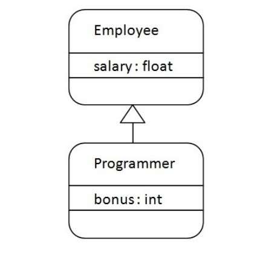
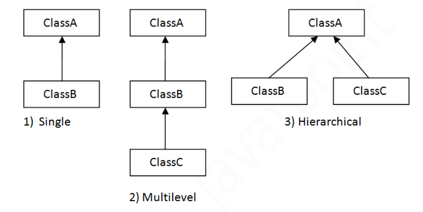

# Buổi 4: Mọi thứ đều là đối tượng
## I. Tính đóng gói (Encapsulation) trong Java
#### 1. Tính đóng gói trong Java là gì?
- **Tính đóng gói (encapsulation)** là việc đóng gói các thuộc tính và phương thức bên trong lớp, tức là thiết kế để các thuộc tính và phương thức thuộc về (bên trong) một lớp.
- Với các **access modifier**, tính đóng gói sẽ có thể giúp ngăn chặn những lớp bên ngoài truy cập, thay đổi thuộc tính và phương thức của một lớp. Từ đó, giúp cho việc **che giấu dữ liệu** (data hiding).
- Để đạt được đóng gói trong Java chúng ta cần:
        + Khai báo các biến của một lớp là private.
        + Cung cấp phương thức setter và getter là public để có thể sửa đổi và xem các giá trị biến.
#### 2. Tại sao cần tính đóng gói?
- Trong lập trình, tính đóng gói giúp *bảo vệ dữ liệu* và *tránh truy cập trực tiếp* đến các thuộc tính của đối tượng từ bên ngoài. Điều này có ích trong việc quản lý và bảo vệ dữ liệu, đồng thời cho phép kiểm soát cách các thành phần khác nhau tương tác với đối tượng đó.
- VD về tính đóng gói:
``` java
public class Person {
    private String name;  // Thuộc tính name là private
    private int age;      // Thuộc tính age là private
    // Phương thức khởi tạo
    public Person(String name, int age) {
        this.name = name;
        this.age = age;
    }
    // Phương thức công khai để lấy tên
    public String getName() {
        return name;
    }
    // Phương thức công khai để lấy tuổi
    public int getAge() {
        return age;
    }
    // Phương thức công khai để thay đổi tuổi
    public void setAge(int age) {
        if (age >= 0) {
            this.age = age;
        }
    }
}
```
- Các phương thức public setAge(), getAge() và getName() là các điểm truy cập đến các biến của lớp Person (getters và setters). Vì vậy, bất kỳ đối tượng nào nào muốn truy cập vào các biến private sẽ truy cập chúng thông qua các trình getters và setters này.
- Lợi ích của đóng gói trong java
  - Tất cả các trường (field) của lớp có có chế độ chỉ đọc (**read-only**) hoặc chỉ ghi (**write-only**), tức là chỉ có hàm getter hoặc setter.
  - Một lớp có thể có toàn bộ điều khiển thông qua những gì được lưu giữ trong các trường (field) của nó.
  - Người sử dụng của class không biết cách các class lưu trữ dữ liệu. Một class có thể thay đổi kiểu dữ liệu của một trường và người dùng class không cần sự thay đổi trong code.
- Tính đóng gói là một nguyên tắc mạnh mẽ trong OOP, giúp tạo ra mã nguồn dễ bảo trì và an toàn hơn bằng cách quản lý truy cập đến thông tin của đối tượng.
## II. Tính kế thừa trong Java
#### 1. Tính kế thừa trong Java là gì?
- Tính kế thừa trong Java là một cơ chế trong đó một đối tượng có được tất cả các thuộc tính và hành vi của một đối tượng cha. 
- Ý tưởng đằng sau tính kế thừa trong Java là việc bạn có thể tạo các class mới được dựa trên các class đã có sẵn. Khi bạn kế thừa từ một class có sẵn, bạn có thể tái sử dụng các phương thức và trường của class cha. Hơn nữa, bạn có thể thêm các phương thức và trường mới trong class hiện tại.
- Tính kế thừa biểu diễn mối quan hệ IS-A, còn được gọi là mối quan hệ cha-con.
- Các thuật ngữ quan trọng trong kế thừa Java:
  - **Lớp cha (Superclass)**: Lớp mà các thuộc tính và phương thức được kế thừa bởi lớp con.
  - **Lớp con (Subclass)**: Lớp kế thừa các thuộc tính và phương thức từ lớp cha.
  - **extends**: Từ khóa  dùng để chỉ rõ lớp con kế thừa từ lớp cha.
  - **super**: Từ khóa dùng để truy cập các thuộc tính và phương thức của lớp cha từ lớp con.
#### 2. Tại sao lại dùng tính kế thừa trong Java?
- Có 1 số lý do vì sao nên dùng kế thừa trong lập trình Java:
  - Khả năng thể hiện các mối quan hệ kế thừa đảm bảo sự gần gũi với các mô hình trong thế giới thực.
  - Khả năng tái sử dụng. Khi dùng tính kế thừa ta có thể lấy 1 class mới từ 1 class hiện có và thêm tính năng mới vào nó mà không cần sửa đổi lớp cha và viết lại lớp cha để kế thừa nó.
  - Tính chất bắc cầu: Nếu lớp 1 kế thừa các thuộc tính từ 1 lớp B, sau đấy hầu hết các lớp con của A sẽ tự động kế thừa từ B. Tính chất này được gọi là tính chất bắc cầu của kế thừa.
#### 3. Cú pháp của tính kế thừa
- Để kế thừa 1 lớp, chúng ta dùng từ khóa **extends**. Cú pháp:
```java
class SubClass extends SuperClass{
// methods and fields
}
```
- VD về tính kế thừa trong Java:

```java
class Employee {  
  float salary = 40000;  
}  

class Programmer extends Employee {  
  int bonus = 10000;
  public static void main(String args[]) {  
    Programmer p = new Programmer();
    System.out.println("Programmer salary is: " + p.salary);  
    System.out.println("Bonus of Programmer is: " + p.bonus);  
  }
}
```
Output:
```
Programmer salary is: 40000.0
Bonus of programmer is: 10000
```
- Ở trên, đối tượng Programmer có thể truy cập trường của riêng lớp nó cũng như của lớp Employee, đấy là ví dụ cho tính tái sử dụng.
#### 4. Các loại kế thừa trong Java
- Trên cơ sở class, có ba kiểu kế thừa trong Java: đơn kế thừa, kế thừa đa cấp, kế thừa thứ bậc.


##### Đơn kế thừa (Single Inheritance)
- Đơn kế thừa: nghĩa là 1 lớp chỉ được kế thừa từ đúng 1 lớp khác. Hay nói cách khác, lớp con chỉ có duy nhất 1 lớp cha.
- VD: ở đây class Dog kế thừa class Animal
```java
class Animal {  
  void eat() {System.out.println("eating...");}  
} 

class Dog extends Animal {  
  void bark() {System.out.println("barking...");}  
}  

class Main {  
  public static void main(String args[]) {  
    Dog d = new Dog();
    d.bark();  
    d.eat();  
  }
}  
```
Output:
```
barking...
eating...
```
##### Kế thừa đa cấp ((Multilevel inheritance))
- Kế thừa đa cấp (multilevel inheritance) được sử dụng khi ta cần tạo ra các lớp con phức tạp và đa dạng, các lớp con này có thể kế thừa các thuộc tính và phương thức từ nhiều lớp cha khác nhau.
- Kế thừa đa cấp cho phép tạo ra một hệ thống kế thừa theo dạng đường thẳng, trong đó, một lớp được kế thừa từ một lớp cơ sở và cũng có thể đóng vai trò là lớp cơ sở cho các lớp khác.
- Kế thừa nhiều cấp là khi có một chuỗi kế thừa. Ở ví dụ dưới đây, BabyDog class kế thừa Dog class mà class này lại kế thừa Animal class, vì thế đây là kế thừa nhiều cấp.
- VD:
```java
class Animal {  
  void eat() {
    System.out.println("eating...");
  }  
} 
class Dog extends Animal {  
  void bark() {
    System.out.println("barking...");
  }  
}

class BabyDog extends Dog {  
  void weep() {
    System.out.println("weeping...");
  }  
}  

class TestInheritance2 {  
   public static void main(String args[]) {  
    BabyDog d = new BabyDog();
    d.weep();
    d.bark();  
    d.eat();  
  }
}  
```
## III. Tính đa hình trong Java

