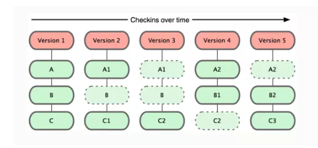
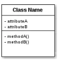
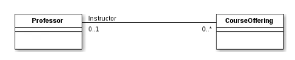
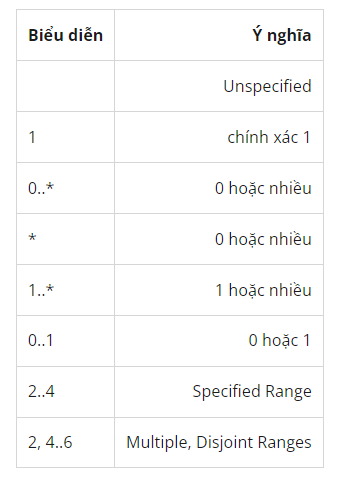
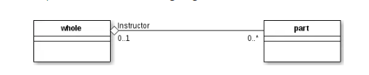
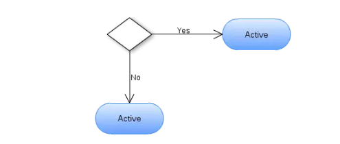
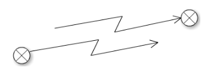
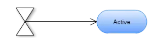
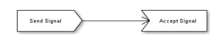
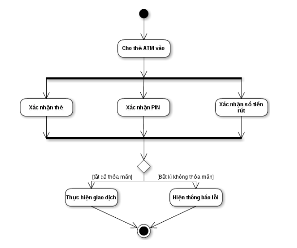

- [\[BUỔI 5\] DEV THÌ KHÔNG CHỈ VIẾT CODE](#buổi-5-dev-thì-không-chỉ-viết-code)
  - [I. Version Control](#i-version-control)
    - [1. Version Control là gì?](#1-version-control-là-gì)
      - [Các loại Version Control](#các-loại-version-control)
    - [2. Tại sao cần dùng Version Control?](#2-tại-sao-cần-dùng-version-control)
- [II. Các khái niệm về Git](#ii-các-khái-niệm-về-git)
    - [1. Git là gì?](#1-git-là-gì)
      - [Git khác các VCS khác như thế nào?](#git-khác-các-vcs-khác-như-thế-nào)
      - [Git có lợi ích gì?](#git-có-lợi-ích-gì)
    - [2. Các thuật ngữ quan trọng trong Git](#2-các-thuật-ngữ-quan-trọng-trong-git)
        - [2.1. Local Repository và Remote Repository](#21-local-repository-và-remote-repository)
        - [2.2. Commit](#22-commit)
        - [2.3. Push](#23-push)
        - [2.4. Pull](#24-pull)
        - [2.5. Branch](#25-branch)
        - [2.6. Fetch](#26-fetch)
        - [2.7. Merge](#27-merge)
        - [2.8. Checkout](#28-checkout)
        - [2.9. Fork repository](#29-fork-repository)
        - [2.10. Clone](#210-clone)
- [III. Pull Request](#iii-pull-request)
        - [Tại sao Pull Request quan trọng](#tại-sao-pull-request-quan-trọng)
        - [Các bước tạo 1 Pull Request](#các-bước-tạo-1-pull-request)
  - [IV. UML](#iv-uml)
      - [1. UML là gì?](#1-uml-là-gì)
  - [V. Mô hình Class Diagram, Activity Diagram](#v-mô-hình-class-diagram-activity-diagram)
      - [1. Mô hình Class Diagram (biểu đồ lớp)](#1-mô-hình-class-diagram-biểu-đồ-lớp)
          - [Một lớp có các thành phần sau](#một-lớp-có-các-thành-phần-sau)
          - [Liên kết giữa các lớp](#liên-kết-giữa-các-lớp)
      - [2. Mô hình Activity Diagram](#2-mô-hình-activity-diagram)
          - [Các thành phần của biểu đồ hoạt động](#các-thành-phần-của-biểu-đồ-hoạt-động)


# [BUỔI 5] DEV THÌ KHÔNG CHỈ VIẾT CODE

## I. Version Control
### 1. Version Control là gì?
Version Control System (VCS) là một loại hệ thống giúp chúng ta quản lý các thay đổi trong source code theo dấu thời gian một cách dễ dàng. Một cách dễ hiểu, VCS lưu trữ source code và mọi thay đổi ta thực hiện trên đó dựa theo dòng thời gian, từ đó có thể đưa code quay trở về trạng thái cũ, hoặc kiểm tra những thay đổi đã thực hiện để dễ dàng sửa lỗi, nâng cấp,...
#### Các loại Version Control
- VCS có hai loại:
  - **Centralized Version Control Systems** (VCS tập trung): Tất cả các folder, file của dự án sẽ nằm tập trung tại 1 server lớn duy nhất, các thành viên tham gia dự án có thể lấy code về, chỉnh sửa, sau đó đẩy code trở lại server. VCS tập trung cũng có hạn chế, nếu không may xảy ra sự cố, mà các sao lưu dự phòng chưa được tạo ra tính đến thời điểm đó, bạn sẽ mất toàn bộ lịch sử của dự án đó, ngoại trừ những phiên bản cục bộ mà người dùng có được trên máy tính cá nhân.
  - Khắc phục nhược điểm của VCS thì một loại VCS nữa được đề xuất đó là **Distributed Version Control Systems** (Hệ thống quản lý phiên bản phân tán). Nó giống với CVCS là có một máy chủ, ở đó có Database lưu giữ các phiên bản của file, tuy nhiên khác biệt đó là các máy client (các developer) kết nối vào thì nó không chỉ lấy file mà nó lấy luôn cả hệ thống Database. Điều này có nghĩa là khi Server bị ngắt, các máy client vẫn làm việc bình thường trên Database ở máy trạm, sau đó commit (chuyển) lên Server sau, hoặc Database ở Server bị lỗi thì bất kỳ máy client nào đều có thể phục hồi lại cho Server
### 2. Tại sao cần dùng Version Control?
- Version Control cần dùng vì nó mang lại nhiều lợi ích cho các lập trình viên, đặc biệt là khi làm việc nhóm.
  - Lưu trữ lịch sử của các thay đổi, từ đó có thể khôi phục lại các phiên bản trước đó, so sánh các phiên bản, xem ai đã thực hiện thay đổi gì và khi nào.
  - Hỗ trợ cộng tác giữa các lập trình viên, từ đó có thể chia sẻ mã nguồn, đồng bộ hóa các thay đổi, giải quyết các xung đột, phân quyền và quản lý quy trình phát triển.
  - Tăng hiệu quả và chất lượng của sản phẩm, từ đó có thể kiểm tra và sửa lỗi dễ dàng, phát hiện và ngăn chặn các vấn đề tiềm ẩn, đảm bảo tính nhất quán và bảo mật của mã nguồn.
# II. Các khái niệm về Git
### 1. Git là gì?
- `Git` là một hệ thống VCS (Version Control System) dùng để quản lý và kiểm tra các phiên bản source code khác nhau trong quá trình phát triển.
- Trên `Git`, có thể lưu trạng thái của file khi có nhu cầu dưới dạng lịch sử cập nhật. Vì thế, có thể đưa file đã chỉnh sửa một lần về trạng thái cũ hay có thể hiển thị sự khác biệt ở nơi chỉnh sửa.
- Thêm nữa, khi định ghi đè (overwrite) lên file mới nhất đã chỉnh sửa của người khác bằng file đã chỉnh sửa dựa trên file cũ, thì khi đăng (upload) lên server sẽ hiện ra cảnh cáo. Vì thế, sẽ không xảy ra thất bại về việc đã ghi đè lên nội dung chỉnh sửa của người khác mà không hề hay biết.
> Vốn là một VCS nên Git cũng ghi nhớ lại toàn bộ lịch sử thay đổi của source code trong dự án. Lập trình viên nào sửa file, thêm dòng code tại đâu, xóa dòng code ở hàng nào… đều được Git ghi nhận và lưu trữ lại.

#### Git khác các VCS khác như thế nào?
Sự khác biệt chính giữa Git và bất kỳ VCS nào khác (bao gồm Subversion…) là cách Git nghĩ về dữ liệu của nó.
- Các VCS khác như: Subversion, Perforce, Bazaar,... coi thông tin được lưu trữ như là 1 tập hợp các tập tin và các thay đổi được thực hiện trên mỗi tập tin theo thời gian
- Git không nghĩ hoặc xử lý dữ liệu theo cách này. Mà thay vào đó, Git coi dữ liệu của nó giống như 1 tập hợp các "ảnh" (snapshot) của một hệ thống tập tin nhỏ. 
- Mỗi khi bạn “commit”, Git sẽ “chụp” và tạo ra một snapshot cùng một tham chiếu tới snapshot đó. Để hiệu quả, nếu các tệp không thay đổi, Git sẽ không lưu trữ lại file — chỉ là một liên kết đến tệp giống file trước đó mà nó đã lưu trữ.

 

> Đây là điểm khác biệt quan trọng giữa Git và gần như tất cả các VCS khác. Nó khiến Git phải xem xét lại hầu hết mọi khía cạnh của VCS mà hầu hết các hệ thống khác đã sao chép từ thế hệ trước. Điều này làm cho Git giống như một hệ thống tệp nhỏ với một số công cụ cực kỳ mạnh mẽ được xây dựng trên nó, thay vì chỉ đơn giản là một VCS. 

#### Git có lợi ích gì?
- Các dự án thực tế thường có nhiều lập trình viên làm việc song song. Vì vậy, Git sẽ đảm bảo không có xung đột code giữa các lập trình viên.
- Các yêu cầu trong các dự án thường sẽ thay đổi thường xuyên. Vì vậy, một VCS cho phép các dev có thể revert và quay lại phiên bản cũ hơn của code.
- Đôi khi một số dự án đang được chạy song song liên quan đến cùng một cơ sở code. Trong trường hợp như vậy, khái niệm `phân nhánh` trong Git là rất quan trọng.
  - Dễ sử dụng, thao tác nhanh, gọn, lẹ và rất an toàn.
  - Dễ dàng kết hợp các phân nhánh (branch), có thể giúp quy trình làm việc code theo nhóm đơn giản hơn rất nhiều.
  - Chỉ cần clone mã nguồn từ kho chứa hoặc clone một phiên bản thay đổi nào đó từ kho chứa, hoặc một nhánh nào đó từ kho chứa là bạn có thể làm việc ở mọi lúc mọi nơi.
  - Deployment sản phẩm của bạn một cách không thể nào dễ dàng hơn.
### 2. Các thuật ngữ quan trọng trong Git
> Local Repository, Remote Repository, Branch, Commit, Merge, Pull, Push, Clone, Fork.
##### 2.1. Local Repository và Remote Repository
- Trước hết, cần hiểu Repository là gì. `Repository` được hiểu là một kho lưu trữ chứa các files của dự án. Các file đó có thể là code, hình ảnh, âm thanh hoặc mọi thứ liên quan đến dự án. 
- Có 2 loại repo: 
  - `Local Repository`: là một lại repository nằm trên máy tính của bạn, repository này có nhiêm vụ đồng bộ hóa với remote repository bằng các lệnh của git.
  - `Remote Repository`: là một loại repository được cài đặt trên server chuyên dụng, ví dụ như: GitHub, GitLab, Bitbucket,…
- Khi tự khởi tạo một repository, chúng ta gõ lệnh `$ git init`, lệnh này sẽ tạo ra một thư mục `.git`, đây chính là repository, còn phần code nằm cùng với thư mục .git được gọi là `Working Directory`

Sau khi gõ lệnh `git init`, nếu nhận được thông báo như sau thì việc thực hiện tạo repository đã thành công

```
Initialized empty Git repository in path_to_folder/.git/
```

##### 2.2. Commit
- Là thao tác để lưu lại trạng thái hiện tại trên hệ thống, ghi nhận lại lịch sử các xử lý: thêm, xóa, cập nhật các file hay thư mục trên repository

- Khi thực hiện, repository sẽ ghi lại sự khác biệt giữa lần commit trước so với hiện tại theo thứ tự thời gian -> có thể xem lại lịch sử thay đổi trong quá khứ dựa theo các commit trước đó
- Để thực hiện một commit, bạn sử dụng lệnh `$ git add .` nếu muốn lưu lại tất cả những file đã thay đổi, thêm, xóa,... hoặc `$ git add path_to_file1 path_to_file2` để lưu lại thay đổi chỉ những files mà bạn muốn

- Tiếp theo chạy lệnh` $ git commit -m "Nội dung muốn commit"` để commit các thay đổi đã lưu lại ở trên.

##### 2.3. Push
- Là hành động đưa những thay đổi đã commit lên một branch nào đó ở remote repository hoặc một branch mới hoàn toàn lên remote repository. Sau khi push lên thì các thành viên của team có thể thấy và đồng bộ code xuống máy local.

- Ví dụ: push một branch có tên là new_feature sau khi hoàn thành một feature (dĩ nhiên là đã commit) lên origin remote thì sẽ sử dụng lệnh sau: `$ git push origin new_feature`
##### 2.4. Pull
- Là hành động cập nhật các thay đổi xuống local repo.
- Ví dụ: Trong khi bạn đang code trên một file thì một người bạn trong nhóm của bạn cũng code trên một file khác cùng branch, người bạn đó hoàn thành công việc, commit và push lên remote repo. Lúc này bạn muốn lấy những thay đổi mà người bạn của bạn đã thực hiện thì bạn sẽ thực hiện hành động Pull xuống.

Vd: Cập nhật code ở branch feature_new ở local với từ remote thì bạn dùng lệnh sau: $ git pull origin feature_new. 'origin' ở đây có thể được thay thế bởi tên của remote repository

##### 2.5. Branch
- Branch được dùng để phân nhánh và ghi luồng của lịch sử. Bạn có thể dùng Branch để triển khai dự án theo hướng cô lập để không ảnh hưởng đến dự án chính. Tại đây cho phép bạn thử nghiệm các tính năng mới hoặc điều chỉnh, sửa lỗi project.
- Khi khởi tạo Repo hoặc Clone, các thành viên sẽ được tạo lập một branch dùng riêng cho công việc của mình từ branch chính để không làm ảnh hưởng đến công việc của những thành viên khác. Branch riêng này sẽ chứa toàn bộ mã nguồn trong kho.
- Sau khi công việc đã hoàn thành, bạn có thể merge branch vừa tạo vào những branch khác hoặc repository chính bằng cách dùng lệnh `Pull Request`.

- Phân loại:
  - **Local branch**: Branch ở phía local, có thể được liên kết với branch trên remote
  - **Remote branch**: Branch ở phía remote. Branch này có thể `fetch` về local những không tạo thêm branch ở local 

##### 2.6. Fetch
- Lệnh `git fetch` tìm nạp các bản sao và tải xuống tất cả các tệp branch vào máy tính của bạn. Sử dụng nó để lưu các thay đổi mới nhất vào kho lưu trữ của bạn. Nó có thể tìm nạp nhiều branch cùng một lúc.

##### 2.7. Merge
- Là việc hợp nhất một nhánh phát triển hoặc hợp nhất lịch sử thay đổi vào nhánh khác.
- Khi muốn tiến hành gộp 2 branch lại với nhau, ta có thể sử dụng git merge: $ `git merge <branch-name>`
##### 2.8. Checkout
- Sử dụng lệnh `git checkout` để chuyển giữa các branch. Chỉ cần nhập git checkout theo sau là tên của branch bạn muốn chuyển đến hoặc nhập `git checkout master` để trở về branch chính (master branch).


##### 2.9. Fork repository
- Là hành động tạo một dự án mới dựa trên dự án đã có sẵn, cho phép bạn sao chép hoàn toàn một repository cũ, sau đó thay đổi hoặc chỉnh sửa một vài thứ cần thiết và lưu phiên bản mới này dưới dạng một repository độc lập hoàn toàn mới và gọi nó là dự án của riêng bạn.
- Các lập trình viên thường tận dụng lợi ích của fork để thử nghiệm các thay đổi mà không ảnh hưởng đến dự án chính.

##### 2.10. Clone
- Git clone là một lệnh để tải xuống mã nguồn hiện có từ một kho lưu trữ từ xa (ví dụ Github). Nói cách khác, Git clone về cơ bản tạo một bản sao giống hệt phiên bản mới nhất của một dự án trong một kho lưu trữ và lưu nó vào máy tính của bạn.
- Có một số cách để tải xuống mã nguồn, nhưng chủ yếu mọi người vẫn dùng cách sao chép bằng https: `git clone <https://name-of-the-repository-link>`
# III. Pull Request
- Pull Request (PR) là một yêu cầu được tạo ra bởi 1 nhóm hoặc 1 lập trình viên để đề xuất thay đổi từ một nhánh chính (thường là main hoặc master) sang một nhánh khác của dự án trên GitHub. Thông qua PR, người tạo yêu cầu có thể trình bày sự thay đổi, giải thích tại sao thay đổi đó cần thiết và cung cấp thông tin chi tiết về quá trình triển khai.

- Pull Request không chỉ giúp tách biệt quá trình xây dựng và đánh giá mà còn thúc đẩy tính bảo mật và kiểm tra chất lượng. Những người khác có thể xem xét, thảo luận và đưa ra ý kiến phản hồi về thay đổi trước khi hợp nhất chúng vào nhánh chính của dự án.
 
##### Tại sao Pull Request quan trọng
- *Đảm bảo chất lượng mã nguồn*: PR giúp đảm bảo rằng tất cả các thay đổi trên mã nguồn đã được xem xét và kiểm tra kỹ lưỡng trước khi hợp nhất vào branch chính -> giúp tránh được các lỗi và xung đột trong quá trình phát triển.
- *Giúp đơn giản hóa quy trình kiểm tra code*: PR cho phép người tham gia dự án có thể đóng góp thay đổi vào mã nguồn một cách dễ dàng. Nó cũng giúp đơn giản hóa quy trình kiểm tra và chấp nhận các thay đổi.
- *Tăng tính minh bạch và sự tham gia của cộng đồng*: PR cho phép cộng đồng tham gia vào quá trình phát triển, giúp tăng sự minh bạch và động lực cho các thành viên khác trong dự án.
- *Đóng góp vào phát triển dự án*: PR cho phép các nhà phát triển đóng góp ý tưởng mới và thay đổi vào dự án một cách dễ dàng. Nhờ đó, dự án sẽ phát triển một cách nhanh chóng và có tính đột phá hơn.
> Tóm lại, Pull Request là một công cụ mạnh mẽ cho phép các nhà phát triển và cộng đồng đóng góp và phát triển mã nguồn của một dự án một cách chính xác và hiệu quả.

##### Các bước tạo 1 Pull Request
- Tạo một branch mới: Trước khi bắt đầu chỉnh sửa mã nguồn, bạn nên tạo một branch mới để làm việc trên đó. Điều này đảm bảo rằng các thay đổi của bạn không ảnh hưởng đến mã nguồn chính của dự án.
- Chỉnh sửa mã nguồn: Tiếp theo, bạn sẽ chỉnh sửa mã nguồn trên branch mới của mình. Bạn có thể thêm, sửa đổi hoặc xóa bất kỳ file nào tùy ý, tùy theo mục đích của bạn.
- Commit thay đổi: Sau khi bạn hoàn thành chỉnh sửa mã nguồn, bạn sẽ phải commit các thay đổi của mình vào branch mới của mình. Mỗi commit sẽ đại diện cho một bản sao của mã nguồn với các thay đổi mới của bạn.
- Tạo Pull Request: Khi các thay đổi của bạn đã được commit vào branch mới, bạn có thể tạo Pull Request để gộp các thay đổi của mình vào nhánh chính của dự án. Trong quá trình tạo Pull Request, bạn sẽ cung cấp thông tin về các thay đổi của mình và mô tả về mục đích của các thay đổi đó.
- Xem xét và thảo luận: Các nhà phát triển khác có thể xem và xem xét các thay đổi của bạn trong Pull Request. Họ có thể đưa ra các ý kiến, đề xuất sửa đổi hoặc chỉnh sửa thêm để tăng tính ổn định và hiệu quả của mã nguồn.
- Merge Pull Request: Cuối cùng, sau khi các thay đổi đã được xem xét và chấp nhận, bạn có thể merge Pull Request vào nhánh chính của dự án. Khi Pull Request được merge, các thay đổi của bạn sẽ được áp dụng vào nhánh chính và được phát hành trong phiên bản tiếp theo của dự án.
## IV. UML
#### 1. UML là gì?
- Ngôn ngữ mô hình hóa thống nhất (UML - Unified Modeling Language) là một ngôn ngữ mô hình gồm các ký hiệu đồ họa mà các phương pháp hướng đối tượng sử dụng để thiết kế các hệ thống thông tin một cách nhanh chóng.

- Cách tiếp cận theo mô hình của UML giúp ích rất nhiều cho những người thiết kế và thực hiện hệ thống thông tin cũng như những người sử dụng nó
- Tạo cái nhìn bao quát và đầy đủ về hệ thống thông tin dự định xây dựng. Cách nhìn bao quát này giúp nắm bắt trọn vẹn các yêu cầu của người dùng; phục vụ từ giai đoạn phân tích đến việc thiết kế, thẩm định và kiểm tra sản phẩm ứng dụng công nghệ thông tin. 
- Các mô hình hướng đối tượng được lập cũng là cơ sở cho việc ứng dụng các chương trình tự động sinh mã trong các ngôn ngữ lập trình hướng đối tượng, chẳng hạn như ngôn ngữ C++, Java,... 
- Các mô hình được sử dụng bao gồm Mô hình đối tượng (mô hình tĩnh) và Mô hình động.
- UML sử dụng một hệ thống ký hiệu thống nhất biểu diễn các *Phần tử mô hình* (model elements). Tập hợp các phần tử mô hình tạo thành các Biểu đồ UML (UML diagrams). Có các loại Biểu đồ UML chủ yếu sau:
  - Biểu đồ lớp (Class Diagram)
  - Biểu đồ hoạt động (Activity Diagram)
  - ...
## V. Mô hình Class Diagram, Activity Diagram
- Theo UML, thì hệ thống có thể được mô tả theo 2 mô hình tĩnh (Static Model) và mô hình động (Dynamic Model).
  - Static Model: mô tả cấu trúc của hệ thống bao gồm các bản vẽ Class Diagram, Object Diagram, Component Diagram và Deployment Diagram.
  - Dynamic Model: mô tả các hoạt động bên trong hệ thống bao gồm các bản vẽ Activity Diagram, State Diagram, Sequence Diagram, Collaboration Diagram.
#### 1. Mô hình Class Diagram (biểu đồ lớp)
- Một biểu đồ lớp chỉ ra cấu trúc tĩnh của các lớp trong hệ thống. Các lớp là đại diện cho các “đối tượng” được xử lý trong hệ thống. Các lớp có thể quan hệ với nhau trong nhiều dạng thức:
  - liên kết (associated - được nối kết với nhau)
  - phụ thuộc (dependent - một lớp này phụ thuộc vào lớp khác)
  chuyên biệt hóa (specialized - một lớp này là một kết quả chuyên biệt hóa của lớp khác)
  - đóng gói (packaged - hợp với nhau thành một đơn vị).
- Tất cả các mối quan hệ đó đều được thể hiện trong biểu đồ lớp, đi kèm với cấu trúc bên trong của các lớp theo khái niệm thuộc tính (attribute) và thủ tục (operation). Biểu đồ được coi là biểu đồ tĩnh theo phương diện cấu trúc được miêu tả ở đây có hiệu lực tại bất kỳ thời điểm nào trong toàn bộ vòng đời hệ thống.

- Một hệ thống thường sẽ có một loạt các biểu đồ lớp – không phải bao giờ tất cả các biểu đồ lớp này cũng được nhập vào một biểu đồ lớp tổng thể duy nhất – và một lớp có thể tham gia vào nhiều biểu đồ lớp.
###### Một lớp có các thành phần sau
- Tên lớp
- Các thuộc tính
- Các phương thức


###### Liên kết giữa các lớp
- **Liên kết (Association)**
  - Mối liên hệ ngữ nghĩa giữa hai hay nhiều lớp chỉ ra sự liên kết giữa các thể hiện của chúng
  - Mối quan hệ về mặt cấu trúc chỉ ra các đối tượng của lớp này có kết nối với các đối tượng của lớp khác.
- Bội số quan hệ: là số lượng thể hiện của một lớp liên quan tới một thể hiện của lớp khác. Với mỗi liên kết, có hai bội số quan hệ cho hai đầu của liên kết.
  - VD: 
   
  - Với mỗi đối tượng của Professor, có nhiều Course Offerings có thể được dạy. Với mỗi đối tượng của Course Offering, có thể có 1 hoặc 0 Professor giảng dạy.
  - Biểu diễn bội số quan hệ:
  

- **Kết tập (Aggregation)**
  - Là một dạng đặc biệt của liên kết mô hình hóa mối quan hệ toàn thể-bộ phận (whole-part) giữa đối tượng toàn thể và các bộ phận của nó.
  - Kết tập là mối quan hệ “là một phần” (“is a part-of”).
  - Bội số quan hệ được biểu diễn giống như các liên kết khác
  - 
  - Cấu thành (Composition) là :Một dạng của kết tập với quyền sở hữu mạnh và các vòng đời trùng khớp giữa hai lớp
  - Whole sở hữu Part, tạo và hủy Part.
  - Part bị bỏ đi khi Whole bị bỏ, Part không thể tồn tại nếu Whole không tồn tại.
  
- **Tổng quát hóa (Generalization)**
  - Mối quan hệ giữa các lớp trong đó một lớp chia sẻ cấu trúc và/hoặc hành vi với một hoặc nhiều lớp khác
  - Xác định sự phân cấp về mức độ trừu tượng hóa trong đó lớp con kế thừa từ một hoặc nhiều lớp cha
▫ Đơn kế thừa (Single inheritance)
▫ Đa kế thừa (Multiple inheritance)
  - Là mối liên hệ “là một loại” (“is a kind of”)

#### 2. Mô hình Activity Diagram
- Activity Diagram là bản vẽ tập trung vào mô tả các hoạt động, luồng xử lý bên trong hệ thống.
- Đối với những luồng thực thi có nhiều tiến trình chạy song song thì biểu đồ hoạt động là sự lựa chọn tối ưu cho việc thể hiện. 

###### Các thành phần của biểu đồ hoạt động
- Trạng thái khởi tạo hoặc điểm bắt đầu (Initial State or Start Point)


- Hoạt động hoặc trạng thái hoạt động (Activity or Action State)
- Nút quyết định và rẽ nhánh
  - Nút rẽ nhánh trong biểu đồ hoạt động được kí hiệu bằng hình thoi màu trắng.



- Thanh tương tranh hay thanh đồng bộ
- Cạnh gián đoạn (Interrupting Edge)



- Luồng hoạt động (Action Folow)
- Phân làn (Swimlanes)
  - Phân làn trong biểu đồ sử dụng là những đường nét đứt thẳng đứng theo các đối tượng. Phần kí hiệu này thường được sử dụng để làm rõ luồng hoạt động của các đối tượng riêng biệt.

- Thời gian sự kiện (Time Event)


- Gửi và nhận tín hiệu (Sent and Received Signals)



- Trạng thái kết thúc hoặc điểm cuối (Final State or End Point)


VD: Biểu đồ hoạt động rút tiền tại cây ATM:


Như trên hình vẽ ta thấy có ba hoạt động cùng diễn ra là xác nhận thẻ, xác nhận mã số PIN và xác nhận số tiền rút.Chỉ khi sử dụng biểu đồ hoạt động mới có thể miêu tả được các hoạt động song song như vậy.