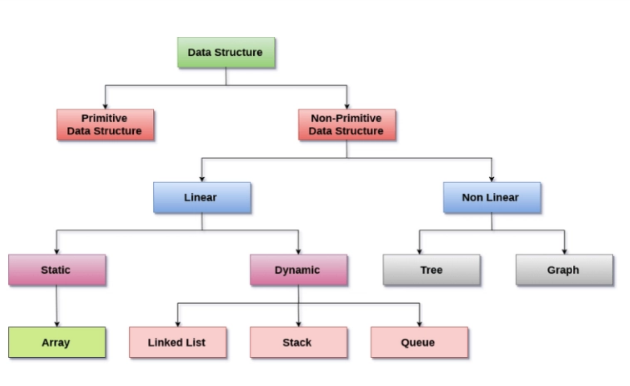
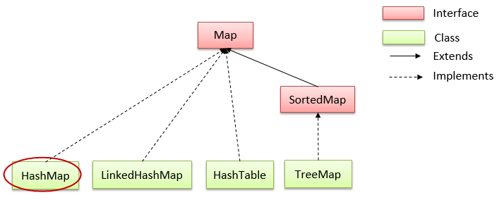
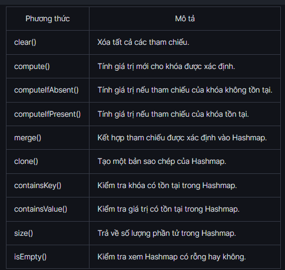

# BUỔI 8: MỘT SỐ CẤU TRÚC DỮ LIỆU THƯỜNG THẤY TRONG JAVA

## I. Cấu trúc dữ liệu là gì?
- CTDL là cách sắp xếp và lưu trữ dữ liệu trong máy tính để có thể truy cập và xử lý một cách hiệu quả. 
- CTDL cung cấp các phương thức và thuật toán để thao tác, truy xuất, chèn, xóa và sắp xếp dữ liệu -> giúp tăng tính hiệu quả và hiệu suất khi làm việc với dữ liệu trong các ứng dụng máy tính.

#### 1. Ưu điểm của việc sử dụng cấu trúc dữ liệu:
  - **Hiệu quả**: CTDL được sử dụng để tăng hiệu quả và hiệu suất của ứng dụng bằng cách tổ chức dữ liệu theo cách mà nó cần ít dung lượng hơn với tốc độ xử lý cao hơn.
  - **Khả năng tái sử dụng**: CTDL cung cấp khả năng tái sử dụng của dữ liệu, đó là sau khi thực hiện 1 CTDL cụ thể một lần, chúng ta có thể sử dụng nó nhiều lần ở bất kỳ nơi nào khác. Chúng ta có thể biên dịch việc triển khai các CTDL này thành các thư viện và khách hàng có thể sử dụng các thư viện này theo nhiều cách.
  - **Tính trừu tượng**: Chương trình chỉ sử dụng CTDL với sự trợ giúp của interface mà không cần biết về chi tiết triển khai.

- Các đặc tính của CTDL:
  - **Tuyến tính** hoặc **phi tuyến tính**: mô tả liệu các mục dữ liệu được sắp xếp theo thứ tự hay không.
  - **Đồng nhất** hoặc **không đồng nhất**: mô tả liệu tất cả các mục dữ liệu trong một kho lưu trữ nhất định có cùng loại hay không.
  - **Tĩnh** hoặc **động**: mô tả cách các cấu trúc dữ liệu được biên dịch. Data structure tĩnh có kích thước, cấu trúc và vị trí bộ nhớ cố định tại thời điểm biên dịch. Data structure động có kích thước, cấu trúc và vị trí bộ nhớ có thể thu nhỏ hoặc mở rộng, tùy thuộc vào việc sử dụng.

    

#### 2. Khi nào sử dụng CTDL?
- Khi lượng dữ liệu phát triển nhanh chóng, các ứng dụng trở nên phức tạp hơn và có thể phát sinh các vấn đề sau:

  - **Tốc độ xử lý**: Do dữ liệu đang tăng lên từng ngày, nên cần phải xử lý tốc độ cao để xử lý lượng dữ liệu khổng lồ này, nhưng bộ xử lý có thể không xử lý được lượng dữ liệu nhiều đó.
  - **Tìm kiếm dữ liệu**: Hãy xem xét một kho có kích thước 200 mặt hàng. Nếu ứng dụng của bạn cần tìm kiếm một mục cụ thể, nó cần phải duyệt qua 200 mục trong mỗi lần tìm kiếm. Điều này dẫn đến làm chậm quá trình tìm kiếm.
  - **Nhiều yêu cầu cùng một lúc**: Giả sử, hàng triệu người dùng đang đồng thời tìm kiếm dữ liệu trên một máy chủ web, thì có khả năng máy chủ bị lỗi.
- Để giải quyết các vấn đề trên, chúng ta sử dụng CTDL. CTDL lưu trữ và quản lý dữ liệu theo cách mà dữ liệu cần thiết có thể được tìm kiếm ngay lập tức. 

## II. Interface Iterable và Collection
### 1. Interface Iterable 
- `Iterable` là một giao diện (`interface`) được định nghĩa trong gói `java.lang`. Giao diện này chứa một phương thức duy nhất là `Iterator<T> iterator()`, nơi mà các lớp triển khai phải cung cấp một trình duyệt (iterator) để duyệt qua các phần tử của tập hợp. Phương thức này trả về một đối tượng Iterator để lặp qua các phần tử trong tập hợp.
- Iterator Interface của Collections trong Java cho phép chúng ta truy cập các phần tử của các tập hợp và được sử dụng để duyệt qua các phần tử trong tập hợp như `Map`, `List` hoặc `Set`. Nó giúp dễ dàng truy xuất các phần tử của một tập hợp và thực hiện các thao tác trên mỗi phần tử. Nó có một Interface con là `ListIterator`. Ngoài ra, Interface này được sử dụng thay thế cho Enumerations trong Collection Framework trong Java.
- Syntax:
```java
public interface Iterable<T> {
    Iterator<T> iterator();
}
```
> - Ở đây, T là tham số kiểu dữ liệu (generic type parameter) đại diện cho kiểu dữ liệu của các phần tử trong tập hợp. Khi triển khai giao diện Iterable, bạn sẽ cần thực hiện phương thức `iterator()` để trả về một đối tượng Iterator.
> - Đối tượng Iterator là một lớp riêng biệt và cũng là một giao diện có cùng tên, gọi là `Iterator<T>`, nơi T là kiểu dữ liệu của các phần tử trong tập hợp. 
> - Khi sử dụng Iterable và Iterator, bạn có thể duyệt qua các phần tử của tập hợp một cách thuận tiện bằng cách sử dụng các cấu trúc lặp như vòng lặp `while` hoặc vòng lặp `for-each`.

- VD:
```java
package IterableInterface;
import java.util.*;
public class Main {
    public static void main(String[] args) {
        List<String> danhSach = new ArrayList<>();
        danhSach.add("Java");
        danhSach.add("Python");
        danhSach.add("C++");
        // Sử dụng Iterable và Iterator để duyệt qua danh sách liên kết
        Iterable<String> iterable = danhSach;
        Iterator<String> iterator = iterable.iterator();
        while (iterator.hasNext()) {
            String phanTu = iterator.next();
            System.out.println(phanTu);
        }
    }
}
```
Output:
```
Java
Python
C++
```
- Sử dụng `giao diện Iterable` giúp cho việc duyệt qua các phần tử trong tập hợp dễ dàng và trừu tượng hơn, giúp tăng tính linh hoạt và tái sử dụng trong việc xử lý dữ liệu trong Java.

#### Các phương thức của Iterator
- `Iterator Interface` cung cấp 4 phương thức có thể được sử dụng để thực hiện các hoạt động khác nhau trên các phần tử của tập hợp.
  - Phương thức `hasNext()`: Trả về true nếu tồn tại một phần tử trong tập hợp.
  - Phương thức `next()`: Trả về phần tử tiếp theo của tập hợp.
  - Phương thức `remove()`: Loại bỏ phần tử cuối cùng được trả về bởi next().
  - Phương thức `forEachRemaining()`: Thực hiện hành động được chỉ định cho từng phần tử còn lại của tập hợp.

### 2. Collection
-  `Collections` là một khung (framework) cung cấp kiến trúc để lưu trữ và thao tác trên các tập hợp đối tượng. Java Collections cho phép bạn làm việc với các dữ liệu phức tạp và cung cấp các giao diện và lớp cài đặt cho một loạt các CTDL,  như danh sách (`List`), tập hợp (`Set`), hàng đợi (`Queue`), và ánh xạ (`Map`), hay các lớp (ArrayList, Vector, LinkedList, PriorityQueue, HashSet, LinkedHashSet, TreeSet...)

    
- `Collection Interface` bao gồm nhiều phương thức khác nhau có thể được sử dụng để thực hiện các thao tác khác nhau trên các đối tượng. Các phương thức này có sẵn trong tất cả các Interface con của nó.
  - Phương thức `add()`, phương thức `size()` , phương thức `remove()`, phương thức `clear()`
  - Phương thức `iterator()` được sử dụng để trả về một vòng lặp để truy cập các phần tử.
  - Phương thức `addAll()` được sử dụng để thêm tất cả các phần tử của một tập hợp cụ thể.
  - Phương thức `removeAll()` được sử dụng để xóa tất cả các phần tử của tập hợp được chỉ định.
    
#### Cách thức chứa dữ liệu
- Cấp cao nhất của lớp Collection là `Iterable interface`, nó chứa dữ liệu thành viên `Iterator interface`.

- Hệ thống phân cấp tiếp theo dẫn đầu bởi 2 interface `Collection` và `Map`:
- Nhóm `Collection` lưu trữ các đối tượng: 
  - `List`: 
    - Là một collection có thứ tự (đôi khi còn được gọi là một chuỗi).
    - Có thể chứa các phần tử trùng lặp.
    - Ví dụ: [1, 7, 1, 3, 1, 1, 1, 5]
    - Có thể get phần tứ “thứ N” trong danh sách. Có thể thêm một phần tử vào bất kỳ một vị trí nào trong danh sách, thay đổi một phần tử nào tại một vị trí nào đó trong danh sách, hoặc xóa một phần tử tại một vị trí bất kỳ trong danh sách.
    - Các lớp triển khai `List Interface`:
      - Vì List là một Interface, do đó, ta sẽ không thể tạo một đối tượng của List.

      - Để sử dụng các phương thức của List Interface, chúng ta có thể sử dụng các lớp sau: `ArrayList, LinkedList, Vector, Stack`.
      - Các lớp này được định nghĩa trong Collections Framework và thực hiện triển khai từ List Interface.
      - 1 số phương thức của List:  add(), addAll(), get(), iterator(), set(), remove(), removaAll(), clear(), size(), toArray()...
    - VD:
```java
import java.util.*;
import java.util.ArrayList;
import java.util.Iterator;
class Main {
    public static void main(String[] args) {
        List <String> list = new ArrayList<>();
        list.add ("Meow Meow");
        list.add(0, "Cats ");
        list.add ("Woof Woof");
        System.out.println(list.size());
        System.out.println(list);
    }
}
```
Output:
```
3
[Cats, Meow Meow, Woof Woof]
```
  - `Queue`:
    - **Queue Interface** trong Java có sẵn trong gói java.util và kế thừa từ Collection Interface, được sử dụng để lưu trữ các phần tử được xử lý theo thứ tự **FIFO**, tức là vào trước ra trước.
    - Các lớp triển khai Queue: Vì Queue là một Interface, chúng ta không thể cung cấp việc triển khai trực tiếp cho nó. Để sử dụng các phương thức của Queue, chúng ta cần sử dụng các lớp triển khai bao gồm: `ArrayDeque, LinkedList, PriorityQueue`
    - Các phương thức của Queue:
      - **add()**: Chèn phần tử được chỉ định vào Queue. Nếu thành công, add() trả về true, nếu không, nó sẽ đưa ra một ngoại lệ.
      - **offer()**: Chèn phần tử được chỉ định vào Queue. Nếu thành công, offer() trả về true, nếu không, nó trả về false.
      - **element()**: Trả về phần đầu của Queue. Đưa ra một ngoại lệ nếu Queue là rỗng.
      - **peek()**: Trả về phần đầu của Queue. Trả về null nếu Queue trống rỗng.
      - **remove()**: Trả về và xóa phần đầu của Queue. Đưa ra một ngoại lệ nếu Queue trống rỗng.
      - **poll()**: Trả về và xóa phần đầu của Queue. Trả về null nếu Queue trống.
      - VD:
    ```java
    import java.util.Queue; 
    import java.util.LinkedList; 
    class Main {     
        public static void main(String[] args) {
            Queue<Integer> a = new LinkedList<>();
            a.offer(43);
            a.offer(23);
            a.offer(12);
            System.out.println(a);
            int b = a.peek();
            System.out.println(b);
        }
    }
    ```
    Output:
    ```
    [43, 23, 12]
    43
    ```
  - `Set`:
    - Set Interface cung cấp các tính năng của tập hợp toán học trong Java. Nó kế thừa Collection Interface. Không giống như List Interface, Set sẽ không thể chứa các phần tử trùng lặp. 
    - Các lớp cài đặt của Set gồm:
      - `HashSet` lưu trữ các phần tử của nó trong bảng băm, là cách thực hiện tốt nhất, tuy nhiên nó không đảm bảo về thứ tự các phần tử được chèn vào.
      - `TreeSet` lưu trữ các phần tử của nó trong một cây, sắp xếp các phần tử của nó dựa trên các giá trị của chúng, về cơ bản là chậm hơn HashSet.
      - `LinkedHashSet` được triển khai dưới dạng bảng băm với có cấu trúc dữ liệu danh sách liên kết, sắp xếp các phần tử của nó dựa trên thứ tự chúng được chèn vào tập hợp (thứ tự chèn).
      - `EnumSet` là một cài đặt chuyên biệt để sử dụng với các kiểu enum.
      - Các phương thức: `add`, `addAll`, `remove`, `clear`, `contains`, `size`, ...
      - VD:
      ```java
      import java.util.*;

        public class Main {
            public static void main(String[] args) {
                Set<String> set = new HashSet<>();
                set.add("Dog");
                set.add("Cat");
                set.add("Fish");
                set.add("Dog");
                System.out.println(set.size()); 
                System.out.println(set.contains("Fish"));
                System.out.println(set);
            }
        }
      ```
      Output:
      ```
      3
      true
      [Cat, Fish, Dog]
      ```
## III. Interface Map và Sorted Map
#### 1. Interface Map
- Các phần tử của Map được lưu trữ trong các cặp **key** và **value**. Khóa là các giá trị duy nhất được liên kết với các giá trị. 1 map không được chứa các khóa trùng lặp. Và, mỗi khóa được liên kết với một giá trị duy nhất. Chúng ta có thể truy cập và sửa đổi các giá trị bằng cách sử dụng các khóa được liên kết.
- Các lớp triển khai Map Interface:


- 1 số phương thức của Map:
  - **put(K, V)**: Chèn tập hợp của khóa K và giá trị V vào Map. Nếu khóa đã có, giá trị mới sẽ thay thế cho giá trị cũ.
  - **replace(K, V)**: Thay giá trị của khóa K bằng giá trị mới được xác định V.
  - **remove(K)**: Xóa mục khỏi Map được thể hiện bằng khóa K.
  - **keySet()**: Trả về một tập hợp tất cả các khóa có trong Map.
  - **values()**: Trả về một tập hợp tất cả các giá trị có trong Map.
  - **entrySet()**: Trả về một tập hợp tất cả ánh xạ khóa / giá trị có trong một Map.
  - 
- VD:
```java
package Map;

import java.util.Map;
import java.util.HashMap;

class Main {
    public static void main(String[] args) {
        Map<Integer, String> sinh_vien = new HashMap<>();
        sinh_vien.put(1 , "Sinh vien Y");
        sinh_vien.put(23 , "Sinh vien Luat");
        System.out.println(sinh_vien);
        System.out.println("Khoa: " + sinh_vien.keySet());
        System.out.println("Gia tri: " + sinh_vien.values());
        System.out.println("Muc: " + sinh_vien.entrySet());
    }
}
```
Output
```
{1=Sinh vien Y, 23=Sinh vien Luat}
Khoa: [1, 23]
Gia tri: [Sinh vien Y, Sinh vien Luat]
Muc: [1=Sinh vien Y, 23=Sinh vien Luat]
```
#### 2. HashMap
- Lớp HashMap trong Java là một lớp triển khai của Map Interface trong Collections Framework nên nó sẽ có một vài đặc điểm và phương thức tương đồng với Map.
- Một số đặc điểm:
  - HashMap lưu trữ dữ liệu dưới dạng cặp key và value.
  - Chứa các key duy nhất.
  - Có thể có 1 key là null và nhiều giá trị null.
  - Duy trì các phần tử KHÔNG theo thứ tự.
- Các phương thức khác của HashMap:

#### 3. Sorted Map, Tree Map
- Vì `SortedMap` là một Interface nên chúng ta không thể tạo các đối tượng từ nó. Để sử dụng các chức năng của SortedMap Interface, chúng ta cần sử dụng `lớp TreeMap` triển khai nó.
- Syntax SortedMap: `SortedMap <key, value> a = new TreeMap<>();`
- Chúng ta đã tạo một SortedMap có tên là a bằng cách sử dụng lớp TreeMap. Trong đó:

  - Key: là một định danh duy nhất được sử dụng để liên kết từng phần tử (value) trong Map.
  - Value: các phần tử được liên kết bởi các key trong Map.
  - Ở đây, chúng ta không sử dụng đối số để tạo một SortedMap. Do đó Map sẽ được sắp xếp theo thứ tự tăng dần.
- Các phương thức của Sorted Map: 
  - `comparator()`: Trả về một bộ so sánh có thể được sử dụng để sắp xếp các khóa trong Map.
  - `firstKey()`: Trả về khóa đầu tiên của SortedMap; `lastKey()`: Trả về khóa cuối cùng của SortedMap.
  - VD:
```java
import java.util.SortedMap; 
import java.util.TreeMap; 
class Main {     
    public static void main(String[] args) {         
        SortedMap<String, Integer> sinh_vien = new TreeMap<>();         
        sinh_vien.put("Nguyen A", 13);         
        sinh_vien.put("Nguyen C", 15);         
        sinh_vien.put("Nguyen B", 14);         
        System.out.println(sinh_vien);         
        System.out.println(sinh_vien.firstKey());         
        System.out.println(sinh_vien.lastKey());         
        int ID_sv = sinh_vien.remove("Nguyen A");         
        System.out.println("ID bi xoa la: " + ID_sv);     
    } 
}
```
Output:
```
{Nguyen A=13, Nguyen B=14, Nguyen C=15}
Nguyen A
Nguyen C
ID bi xoa la: 13
```
- `Lớp TreeMap`: là một lớp triển khai của SortedMap, SortedMap kế thừa Map interface. Nên nó sẽ có một vài đặc điểm và phương thức tương đồng với Map và SortedMap.
- Syntax TreeMap: `TreeMap <Key, Value> a = new TreeMap<>();`

## V. Sorting trong Collections
- Lớp Collections là một thành phần trong `Java Collection Framework`, nó cung cấp phương thức `sort()` để sắp xếp các phần tử của collection.
  - Phương thức `Collections.sort(List)`: được sử dụng để sắp xếp các phần tử của `List`, với điều kiện các phần tử của List phải là kiểu `Comparable`, nghĩa là lớp các phần tử phải được implements giao diện Comparable.
  - Lớp `String` và các lớp `Wrapper` được implements giao diện Comparable => Có thể áp dụng phương thức Collections.sort(List list) mà không phải cài đặt gì thêm.
  - Còn đối với List của các đối tượng do người dùng tự định nghĩa thì phải implements giao diện Comparable cho lớp của đối tượng đó.
- VD:
```java
import java.util.ArrayList;
import java.util.Collections;

public class Main {
    public static void main(String[] args) {
        ArrayList<String> list = new ArrayList<>();
        list.add(10);
        list.add(9);
        list.add(15);
        list.add(2);

        System.out.print("Danh sách ban đầu: ");
        System.out.println(list);

        //Sắp xếp với Collections.sort()
        Collections.sort(list);
        System.out.print("Danh sách sau khi sắp xếp: ");
        System.out.println(list);
    }
}
```
Output:
```
Danh sách ban đầu: [10, 9, 15, 2]
Danh sách sau khi sắp xếp: [2, 9, 10, 15]
```
- Đối với `String` và các `lớp Wrapper`, mặc định là sắp xếp tăng dần
- Sắp xếp giảm dần: Sử dụng phương thức `Collections.sort(list, new Comparator<T>())`
- VD:
```java
package Map;

import java.util.*;

public class Main {
    public static void main(String[] args) {
        List<Integer> list = new ArrayList<>();
        list.add(10);
        list.add(5);
        list.add(9);
        list.add(20);
        System.out.println(list);
        Collections.sort(list, new Comparator<Integer>() {
            @Override // override Interface Comparator
            public int compare(Integer a1, Integer a2) {
                return a1 > a2 ? -1 : 0;
            }
        });
        System.out.println(list);
    }
}
```
Output:
```
[10, 5, 9, 20]
[20, 10, 9, 5]
```
- Đối với các đối tượng người dùng tự định nghĩa:
  - Cách 1: phải implements giao diện `java.lang.Comparable` để cài đặt phương thức `compareTo()`
  ```java
  public class SinhVien implements Comparable<SinhVien> {
    private String name, msv;
    private double gpa;

    public SinhVien(String name, String msv, double gpa) {
        this.name = name;
        this.msv = msv;
        this.gpa = gpa;
    }
     //getter & setter name, msv, gpa
    @Override // override interface Comparable
    public int compareTo(SinhVien o) {
        return this.getName().compareTo(o.getName());
    }
    }
    public class Main {
        public static void main(String[] args) {
            List<SinhVien> list = new ArrayList<>();
            list.add(new SinhVien("AB", "001", 3.2));
            list.add(new SinhVien("AAA", "003", 3.0));
            list.add(new SinhVien("BCB", "002", 2.0));
            Collections.sort(list);
            for(SinhVien sinhVien : list){
                System.out.println(sinhVien.getName());
            }
        }
    }
  ```

Output:
```
AAA
AB
BCB
```
- Cách 2: Tạo `đối tượng Comparator` để cài đặt phương thức `compare()`.Phải cài đặt tiêu chí để so sánh trong phương thức compare() để so sánh các đối tượng với nhau:
- VD:
```java
public class SinhVien{
    private String name, msv;
    private double gpa;
    // getter setter name, msv, gpa
    public SinhVien(String name, String msv, double gpa) {
        this.name = name;
        this.msv = msv;
        this.gpa = gpa;
    }
}
public class Main {
    public static void main(String[] args) {
        List<SinhVien> list = new ArrayList<>();
        list.add(new SinhVien("AB", "001", 3.2));
        list.add(new SinhVien("AAA", "003", 3.0));
        list.add(new SinhVien("BCB", "002", 2.0));
        Collections.sort(list, new Comparator<SinhVien>() {
            @Override
            public int compare(SinhVien a1, SinhVien a2) {
                return a1.getmsv().compareTo(a2.getmsv());
            }
        });
        for(SinhVien sinhVien : list){
            System.out.println(sinhVien.getmsv()); 
        }
    }
}
```
Output: 
```
001
002
003
```