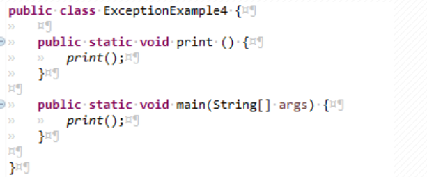
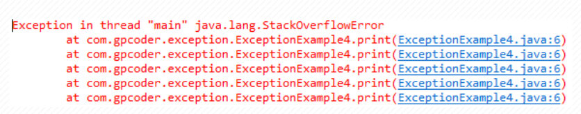
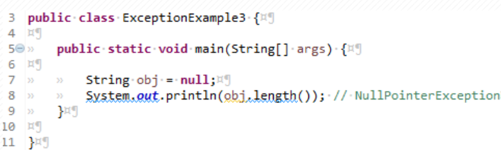
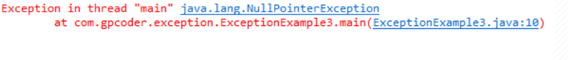
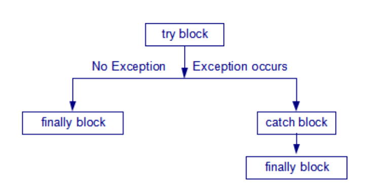
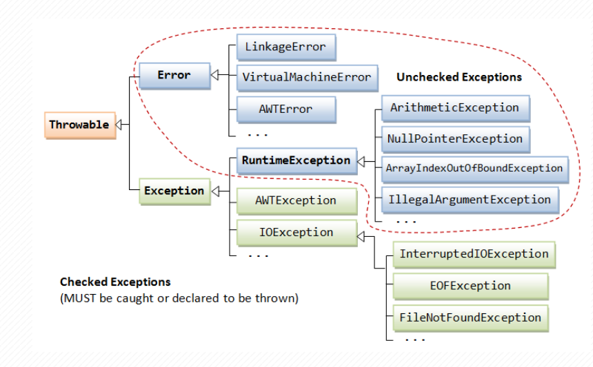
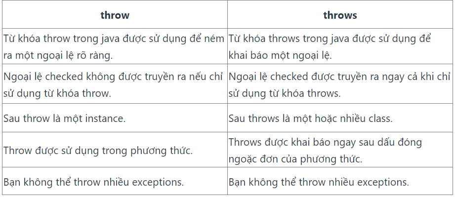

- [BUỔI 9: LUÔN CÓ NGOẠI LỆ, XỬ LÍ NGOẠI LỆ](#buổi-9-luôn-có-ngoại-lệ-xử-lí-ngoại-lệ)
    - [I. Làm quen với Exception](#i-làm-quen-với-exception)
        - [1. Exception là gì?](#1-exception-là-gì)
        - [2. Phân loại Exception](#2-phân-loại-exception)
          - [2.1. Error](#21-error)
          - [2.2. Checked exceptions](#22-checked-exceptions)
          - [2.3. Unchecked exceptions](#23-unchecked-exceptions)
    - [II. Xử lý Exception](#ii-xử-lý-exception)
        - [1. Khối try-catch trong Java](#1-khối-try-catch-trong-java)
        - [2. Sử dụng finally](#2-sử-dụng-finally)
    - [III. Cây phân cấp Exception, phân biệt throw và throws](#iii-cây-phân-cấp-exception-phân-biệt-throw-và-throws)
        - [1. Cây phân cấp Exception](#1-cây-phân-cấp-exception)
        - [2. Phân biệt throw và throws](#2-phân-biệt-throw-và-throws)
          - [a. Từ khóa throw](#a-từ-khóa-throw)
          - [b. Từ khóa throws trong Java](#b-từ-khóa-throws-trong-java)
          - [c. Phân biệt throw và throws](#c-phân-biệt-throw-và-throws)
    - [IV. Tạo ra Exception của riêng mình](#iv-tạo-ra-exception-của-riêng-mình)
        - [Tại sao cần sử dụng Custom Exception?](#tại-sao-cần-sử-dụng-custom-exception)

# BUỔI 9: LUÔN CÓ NGOẠI LỆ, XỬ LÍ NGOẠI LỆ

### I. Làm quen với Exception
##### 1. Exception là gì?
- Exception là một sự kiện xảy ra trong quá trình thực thi một chương trình Java, nó làm phá vỡ **flow** (luồng xử lý) bình thường của một chương trình, thậm chí chết chương trình.

- Exception có thể xảy ra với nhiều lý do khác nhau, nằm ngoài dự tính của chương trình, có thể xảy ra bởi lỗi của người dùng, của lập trình viên hoặc từ lỗi của nguồn dữ liệu vật lý. Chẳng hạn như:
  - Người dùng nhập dữ liệu không hợp lệ.
  - Truy cập ngoài chỉ số mảng.
  - Một file cần được mở nhưng không thể tìm thấy.
  - Kết nối mạng bị ngắt trong quá trình thực hiện giao tiếp hoặc JVM hết bộ nhớ.

- Trong Java, `Throwable` là lớp cơ sở dành cho tất cả các đối tượng mà có thể được ném (throw) hoặc bắt (catch) bởi câu lệnh try-catch. Throwable có hai lớp con trực tiếp gồm `Exception` và `Error`.
##### 2. Phân loại Exception
- Trong Java có 3 loại exception là **Error**, **Checked Exception**, và **Unchecked Exception**(runtime exception).
###### 2.1. Error
- Error là những vấn đề nghiêm trọng liên quan đến môi trường thực thi của ứng dụng hoặc hệ thống mà lập trình viên không thể kiểm soát. Nó thường làm chết chương trình.
- Lớp Error định nghĩa các ngoại lệ mà không thể bắt (catch) từ chương trình.
- Ví dụ: OutOfMemoryError, VirtualMachineError, and StackOverflowError
- VD chương trình đệ quy vô tận sẽ có Error:



###### 2.2. Checked exceptions
- Là loại exception xảy ra trong lúc compile time, nó cũng có thể được gọi là `compile time exceptions`. Loại exception này không thể bỏ qua được trong quá trình compile, bắt buộc ta phải handle nó.
- Các lớp extends từ lớp `Throwable` ngoại trừ RuntimeException và Error được gọi là checked exception.
- Ví dụ: IOException, FileNotFoundException, NoSuchFieldException, ….
###### 2.3. Unchecked exceptions
- Là loại exception xảy ra tại thời điểm thực thi chương trình, nó cũng có thể gọi là `runtime exceptions` đó là programming bugs, lỗi logic của chương trình… Loại exception này được bỏ qua trong quá trình compile, không bắt buộc ta phải handle nó.  
- Các lớp extends từ `RuntimeException` được gọi là unchecked exception.
- Một vài runtime exception phổ biến:
  - `IllegalArgumentException`: lỗi xảy ra khi truyền đối số không phù hợp cho phương thức
  - `NullPointerException`: lỗi truy cập con trỏ rỗng
  - `ArrayIndexOutOfBoundsException`: lỗi truy cập index của các phần tử không thuộc mảng
  - `ArithmeticException`: lỗi chia cho số 0

- Ví dụ một biến có giá trị null, thực hiện bất kỳ hoạt động nào bởi biến đó sẽ xảy ra ngoại lệ NullPointerException.



### II. Xử lý Exception 
##### 1. Khối try-catch trong Java
- Khối try-catch trong Java được sử dụng để xử lý các ngoại lệ (exceptions) trong chương trình. Khi một ngoại lệ xảy ra trong khối `try`, nó sẽ được bắt bởi khối `catch` tương ứng, giúp chương trình không bị dừng đột ngột.
- Syntax:
```java
try {
    // Mã lệnh có thể gây ra ngoại lệ
} catch (Exception_Type e) {
    // Xử lý ngoại lệ ở đây
}
```
- `try`: Khối mã lệnh mà bạn muốn kiểm tra ngoại lệ.
- `catch`: Khối mã lệnh sẽ được thực thi nếu ngoại lệ xảy ra. Exception_Type là kiểu ngoại lệ mà bạn muốn bắt.
- VD: Lỗi chia cho 0:
```java
package TryCatch;

public class Main {
    public static void main(String[] args) {
        int result = 50/0;
        System.out.println("Phép chia cho 0");
    }
}
```
Exception ở console:
```
Exception in thread "main" java.lang.ArithmeticException: / by zero
	at TryCatch.Main.main(Main.java:11)
```
```java
package TryCatch;

public class Main {
    public static void main(String[] args) {
        try {
            int result = 50 / 0; // Sẽ ném ra ArithmeticException
        } catch (ArithmeticException e) {
            System.out.println("Lỗi chia cho 0: " + e.getMessage());
        }
        System.out.println("Phép chia cho 0");
    }
}

```
Output:
```
Lỗi chia cho 0: / by zero
Phép chia cho 0
```

##### 2. Sử dụng finally
- Khối finally trong là một khối được sử dụng để thực thi các phần code quan trọng như đóng kết nối, đóng stream,… 

- Cấu trúc khối finally trong Java:
```java
try{
  //Các lệnh có khả năng ném ra ngoại lệ
} catch(Exception1 ex1){
…
} catch(Exception2 ex2){
…
} catch(Exception exn){
…
} finally{
//Mã lệnh dọn dẹp
}
```
- Khối finally là tuỳ chọn, không bắt buộc phải có. Khối này được đặt sau khối catch cuối cùng. Chương trình sẽ thực thi câu lệnh đầu tiên của khối finally ngay sau khi gặp câu lệnh `return` hay lệnh `break` trong khối try.
- Khối finally bảo đảm lúc nào cũng được thực thi, bất chấp có ngoại lệ xảy ra hay không. Hình minh họa sự thực hiện của các khối try, catch và finally



VD:
```java
package TryCatch;

public class Main {
    public static void main(String args[]) {
        try {
            int data = 25 / 5;
            System.out.println(data);
        } catch (NullPointerException e) {
            System.out.println(e);
        } finally {
            System.out.println("finally block is always executed");
        }
        System.out.println("rest of the code...");
    }
}
```
Output:
```java
5
finally block is always executed
rest of the code...
```
- Câu lệnh in ra dòng "`finally block executed`" sẽ luôn được hiển thị ra bất chấp code của chúng ta có rơi vào exception hay không.
### III. Cây phân cấp Exception, phân biệt throw và throws
##### 1. Cây phân cấp Exception
- Mô hình sơ đồ phân cấp của Exception trong java:
  - Class ở mức cao nhất là `Throwable`
  - Hai class con trực tiếp là `Error` và `Exception`.
- Trong nhánh `Exception` có một nhánh con RuntimeException là các ngoại lệ sẽ không được java kiểm tra trong thời điểm biên dịch.



##### 2. Phân biệt throw và throws
###### a. Từ khóa throw
- Ta có thể ném một trong hai ngoại lệ `checked` hoặc `unchecked` trong java bằng từ khóa throw. Từ khóa throw chủ yếu được sử dụng để ném ngoại lệ tùy chỉnh (ngoại lệ do người dùng tự định nghĩa).
- Cú pháp:
```java
throw exception;
```
- VD: tạo ra phương thức `validate()` với tham số truyền vào là giá trị integer. Nếu tuổi dưới 18, chúng ta ném ra ngoại lệ `ArithmeticException` nếu không in ra một thông báo “welcome”.
```java
package TryCatch.ThrowDemo;

public class ThrowException {
    static void validate(int age) {
        if (age < 18)
            throw new ArithmeticException("invalid");
        else System.out.println("welcome to vote");
    }
    public static void main(String args[]) {
        validate(13);
        System.out.println("rest of the code...");
    }
}

```
Output:
```java
Exception in thread "main" java.lang.ArithmeticException: invalid
	at TryCatch.ThrowDemo.ThrowException.validate(ThrowException.java:6)
	at TryCatch.ThrowDemo.ThrowException.main(ThrowException.java:10)
``` 
- Lưu ý khi throw ra một exception trong một phương thức thì hoặc:
  - Phải dùng từ khóa `throws` để bỏ qua ngoại lệ đó.
  - Phải dùng khối `try-catch` để bắt ngoại lệ đó.
  
###### b. Từ khóa throws trong Java
- Từ khóa `throws` được sử dụng trong khai báo phương thức để khai báo kiểu loại ngoại lệ mà có thể xảy ra bên trong.
- Từ khóa throws được khai báo ở cuối dấu ngoặc () trước khi bắt đầu một phương thức.
- VD:
```java
import java.io.*;
public class DemoJava {
    public static void main(String[] args) throws IOException {
       FileOutputStream fileOutputStream = null;
       fileOutputStream = new FileOutputStream("D://output.txt");
       fileOutputStream.write(65);
    }
}
```
- Ở ví dụ trên phương thức main đã khai báo bỏ qua ngoại lệ IOException nên chương trình trên vẫn chạy bình thường.

###### c. Phân biệt throw và throws



### IV. Tạo ra Exception của riêng mình
##### Tại sao cần sử dụng Custom Exception?
- Khi phát triển một ứng dụng Java phức tạp, có thể bạn muốn xử lý các tình huống đặc biệt mà các lớp ngoại lệ có sẵn trong Java không đáp ứng. Trong trường hợp này, việc tạo một ngoại lệ tùy chỉnh sẽ giúp bạn:
  - Định rõ tình huống đặc biệt.
  - Cung cấp thông điệp ngoại lệ riêng để ghi log hoặc hiển thị cho người dùng cuối.
  - Tùy chỉnh cách xử lý ngoại lệ để phù hợp với logic ứng dụng.

- Để tạo một Custom Exception trong Java, ta cần tạo một lớp kế thừa từ lớp `Exception` hoặc các lớp con của nó. Dưới đây là một ví dụ về cách tạo một Custom Exception có tên là `InvalidAgeException`:
```java
class InvalidAgeException extends Exception {
    InvalidAgeException(String s) {
        super(s);
    }
}
```
- Ở đây, chúng ta đã tạo một lớp InvalidAgeException kế thừa từ Exception. Lớp này có một constructor để truyền thông điệp ngoại lệ.
```java
package TryCatch.CustomException;

class TestCustomException{

    static void validate(int age) throws InvalidAgeException {
        if (age < 18)
            throw new InvalidAgeException("Chưa đủ tuổi");
        else
            System.out.println("Chúc mừng bạn đã đủ tuổi bầu cử");
    }

    public static void main(String args[]) {
        try {
            validate(13);
        } catch (InvalidAgeException e) {
            System.out.println("Xảy ra ngoại lệ: " + e.getMessage());
        }

        System.out.println("Phần còn lại của mã...");
    }
}

```
Output:
```java
Xảy ra ngoại lệ: Chưa đủ tuổi
Phần còn lại của mã...
```
- Trong ví dụ này, chúng ta đã tạo một phương thức `validate()` kiểm tra tuổi và ném ngoại lệ `InvalidAgeException` nếu tuổi không hợp lệ. Trong main method, chúng ta đã `bắt ngoại lệ` và hiển thị thông điệp ngoại lệ.


