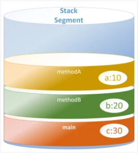
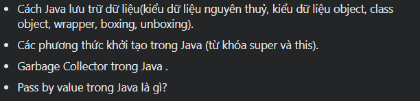
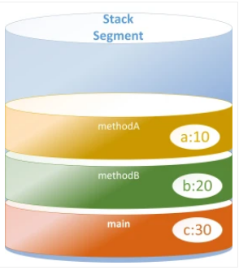
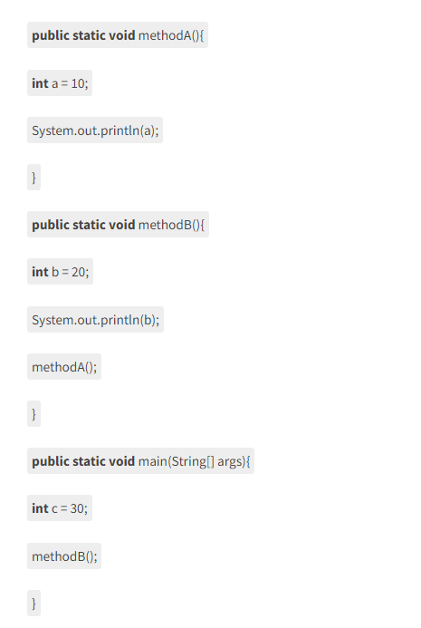

#Buổi 3: CÁCH JAVA LƯU TRỮ DỮ LIỆU

## 1. Cách Java lưu trữ dữ liệu
- Khi một chương trình Java được thực thi, nó sẽ yêu cầu hệ điều hành cấp phát một không gian trên bộ nhớ để lưu trữ toàn bộ dữ liệu và thông tin của nó.
- Sau đó, nó sẽ chia vùng không gian đó thành 4 vùng nhớ (memory segment) để lưu trữ. 
 

- Vùng nhớ code (**code segment**), theo như tên gọi của nó, tất cả mã chương trình (**machine code**) được lưu ở đây khi chương trình được thực thi.
- Vùng nhớ data (**data segment**), đây là nơi lưu trữ những dữ liệu chung của chương trình như các **biến static, constant**,… những biến dữ liệu mà được sinh ra khi chương trình bắt đầu thực thi và chỉ được giải phóng khi chương trình kết thúc.
- Vùng nhớ stack (**stack segment**), đây sẽ là nơi lưu trữ các **biến nguyên thủy** (primitive data type như là boolean, int, char,…) và **địa chỉ của ô nhớ** (memory address).
- **Tại sao gọi là vùng nhớ stack?** Bởi vì dữ liệu ở đây chia theo các nhóm gọi là **stack frame**, và mỗi stack frame sẽ được lưu vào vùng nhớ stack theo cơ chế ***Last-in-first-out (LIFO)*** như một stack.

- Stack frame (SF)là nơi lưu trữ toàn bộ các **biến của một phương thức (method)**, mỗi phương thức được thực thi sẽ tạo ra một SF. 
- VD: Ở chương trình dưới ta có 3 method: methodA(), methodB(), main() 

- Khi chương trình này thực thi, nó sẽ tạo ra 3 SF và push vào vùng nhớ stack theo thứ tự nó được gọi: *main, methodB, methodA.*
- Với phương thức main() ta có biến c = 30 nên giá trị 30 này sẽ được lưu trữ ở SF main, và biến c này cũng sẽ có phạm vi sử dụng trong phương thức main() mà thôi. 

- Tương tự với các phương thức methodB() và methodA(), ta cũng sẽ có các biến b và a tương ứng. Biến b sẽ được lưu trữ ở SF methodB và chỉ có phạm vi sử dụng ở đó, tương tự cho biến a cũng sẽ được lưu trữ ở SF methodA và chỉ có phạm vi sử dụng ở đây thôi nhé.

- Khi methodA() thực thi xong, SF methodA sẽ được pop ra khỏi vùng nhớ stack, biến a (với giá trị là 10) đồng thời cũng được giải phóng. Sau đó SF methodB sẽ được pop, biến b được giải phóng và cuối cùng là tới SF main và biến c.

####1.1. Biến nguyên thủy (Primitive Value)
- Tất cả các biến thuộc kiểu dữ liệu tham chiếu đều được lưu trên **vùng nhớ stack**.
####1.2. Kiểu dữ liệu object
- 3 kiểu dữ liệu object:

| Kiểu dữ liệu          | Mô tả                                                                                                                                                    |
| --------------------- | -------------------------------------------------------------------------------------------------------------------------------------------------------- |
| Array                 | Một mảng của các dữ liệu cùng kiểu. VD: tên sinh viên                                                                                                    |
| Lớp (Class)           | Tập hợp các biến và các phương thức.Ví dụ : lớp “Sinhviên” chứa toàn bộ các chi tiết của một sinh viên và các phương thức thực thi trên các chi tiết đó. |
| Giao diện (Interface) | Là một lớp trừu tượng được tạo ra cho phép cài đặt đa thừa kế trong Java.                                                                                |
- Những biến thuộc kiểu dữ liệu tham chiếu (hay biến tham chiếu) sẽ được lưu tại **vùng nhớ stack** và đối tượng sinh ra (*sau toán tử new*) sẽ được lưu tại **vùng nhớ heap**. Giá trị của biến tham chiếu chính là địa chỉ của đối tượng được sinh ra đó. (Biến được lưu tại vùng nhớ stack, giá trị là địa chỉ của một đối tượng được lưu tại vùng nhớ heap).

VD: String a = new String("Java");
- Đầu tiên là String a: Cấp phát một ô nhớ trên vùng nhớ stack, ô nhớ này chính là biến tham chiếu a.
- newString(): Cấp phát một ô nhớ trên vùng nhớ heap, ô nhớ này là một đối tượng kiểu String, việc cấp ô nhớ này do toán tử *new* thực hiện.
- String(“Java”): Gán giá trị “Java” cho ô nhớ trên vùng nhớ heap.
- a = new String(“Java”): Gán địa chỉ của đối tượng trên vùng nhớ heap cho value của ô nhớ trên vùng nhớ stack (biến tham chiếu a).

|Primitive Data Type                                                  | Reference Data Type                                                                                |
| -------------------------------------------------------------------- | -------------------------------------------------------------------------------------------------- |
| Biến được lưu tại vùng nhớ stack, giá trị là các kiểu dữ liệu cơ sở. | Biến được lưu tại vùng nhớ stack, giá trị là địa chỉ của một đối tượng được lưu tại vùng nhớ heap. |

####1.3. Class object

####1.4. Lớp Wrapper
- Khi một lớp Wrapper được tạo ra, một tệp mới sẽ được tạo ra và ở đó, chúng ta sẽ lưu trữ các kiểu dữ liệu nguyên thủy. Đối tượng của lớp Wrapper bọc hoặc giữ kiểu dữ liệu nguyên thủy tương ứng của nó.

- Quá trình chuyển đổi các kiểu dữ liệu nguyên thủy thành một đối tượng gọi là boxing. Trong khi sử dụng một lớp wrapper, bạn chỉ cần truyền giá trị của kiểu dữ liệu nguyên thủy cho phương thức khởi tạo của lớp Wrapper.

- Tất cả các lớp Wrapper Byte, Short, Integer, Long, Double và Float, là các lớp con của lớp trừu tượng Number. Trong khi các lớp của Character và Boolean wrapper là các lớp con của lớp Object.
####1.5. Boxing

####1.6. Unboxing
- 